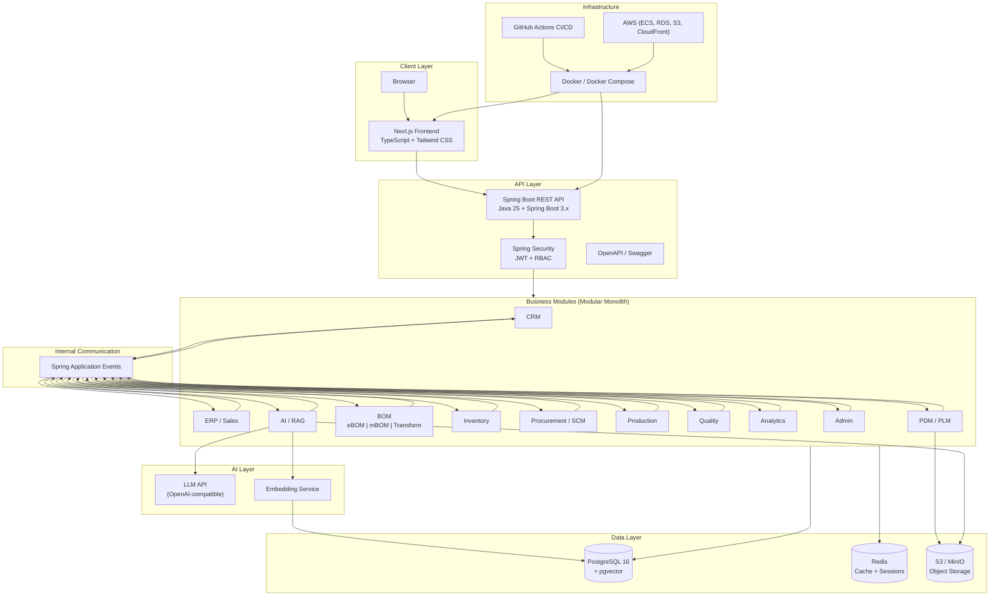
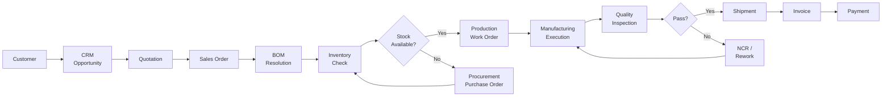
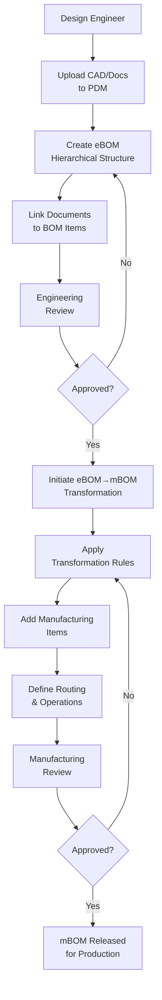
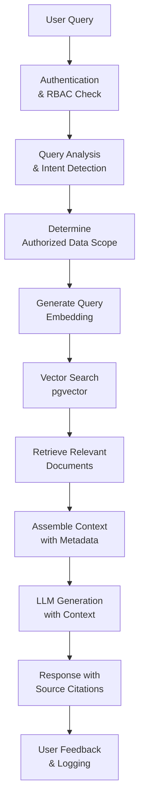
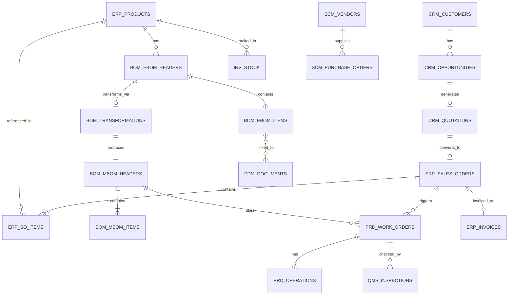
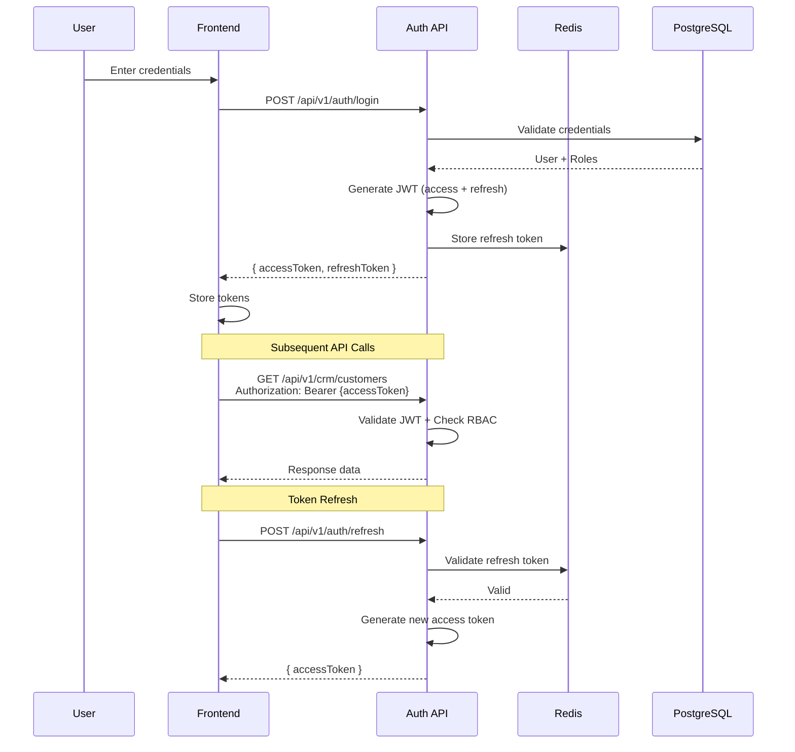
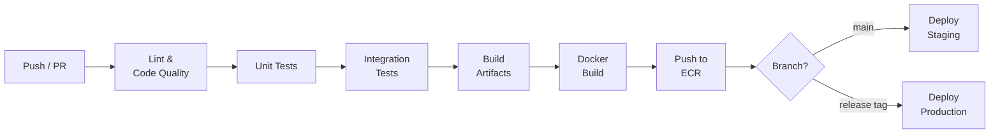
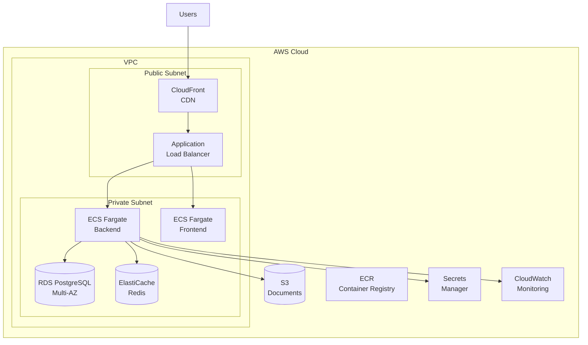

# System Architecture
## Smart Manufacturing Digital Transformation Platform

### G. System Architecture

#### Architecture Style: Modular Monolith
The platform is designed as a **Modular Monolith** to balance the simplicity of deployment with the clean boundaries of microservices.

- **Single Deployable Unit**: The system runs as a single deployable Spring Boot application with well-defined module boundaries.
- **Package Isolation**: Each module has its own distinct package structure (controller, service, repository, model, dto, event), ensuring clear separation of concerns.
- **Event-Driven Communication**: Modules communicate via domain events (using Spring `ApplicationEventPublisher`) rather than direct service calls across module boundaries. This decouples the modules significantly.
- **Shared Kernel**: Common cross-cutting concerns (authentication, authorization, audit logging, exceptions, and base entities) are centralized in a shared kernel.
- **Clean Dependencies**: Modules are strictly prohibited from depending on each other's internals. They depend only on the shared kernel and communicate via events.
- **Future-Proof**: This architecture provides a clear future path. If scalability demands it, modules can be easily extracted into independent microservices by replacing in-memory Spring events with a distributed message broker (e.g., Kafka or RabbitMQ).

#### Package Structure
```
com.sivamachineworks.platform
├── shared/           # Shared kernel (auth, audit, base entities, exceptions, config)
├── crm/              # CRM module
├── erp/              # ERP / Sales Order module
├── pdm/              # PDM / PLM module
├── bom/              # BOM module (eBOM, mBOM, transformation)
│   ├── ebom/
│   ├── mbom/
│   └── transform/
├── inventory/        # Inventory management
├── procurement/      # SCM / Procurement
├── production/       # Production management
├── quality/          # Quality management
├── analytics/        # Business analytics
├── ai/               # AI / RAG module
│   ├── rag/
│   ├── embedding/
│   └── docprocessing/
└── admin/            # Administration
```

#### High-Level Architecture Diagram


#### Order-to-Cash Workflow


#### eBOM to mBOM Transformation Workflow


#### AI/RAG Workflow


---

### H. Database Architecture

#### Design Principles
- **Module Ownership**: Each module exclusively owns its tables, logically partitioned by prefix (e.g., `crm_`, `erp_`, `pdm_`, `bom_`, `inv_`, `scm_`, `prd_`, `qms_`, `ana_`, `ai_`, `adm_`).
- **Shared Metadata**: Shared tables (e.g., `users`, `roles`, `permissions`, `audit_log`) address cross-cutting concerns.
- **Traceability**: Implementation of the soft delete pattern (`deleted_at` timestamp) ensures full traceability and recovery capabilities.
- **Comprehensive Auditability**: Audit columns (`created_by`, `created_at`, `updated_by`, `updated_at`) are universally applied across all business entities.
- **Global Identifiers**: UUID primary keys are utilized for all entities to prevent enumeration attacks and simplify potential future distributed configurations.
- **Loose Coupling**: Foreign key constraints are enforced strictly within a module. Cross-module references rely on IDs without database-level FK constraints to preserve module independence.

#### Core Tables by Module

**Shared / Admin**
- `users` (id, email, password_hash, full_name, department, is_active, ...)
- `roles` (id, name, description, ...)
- `user_roles` (user_id, role_id)
- `permissions` (id, module, action, description)
- `role_permissions` (role_id, permission_id)
- `audit_log` (id, user_id, action, entity_type, entity_id, old_value, new_value, ip_address, timestamp)

**CRM**
- `crm_customers` (id, company_name, industry, country, ...)
- `crm_contacts` (id, customer_id, name, email, phone, ...)
- `crm_opportunities` (id, customer_id, title, stage, value, probability, ...)
- `crm_quotations` (id, opportunity_id, customer_id, status, total_amount, valid_until, ...)
- `crm_quotation_items` (id, quotation_id, product_id, quantity, unit_price, ...)

**ERP**
- `erp_sales_orders` (id, customer_id, quotation_id, status, order_date, total_amount, ...)
- `erp_sales_order_items` (id, sales_order_id, product_id, quantity, unit_price, ...)
- `erp_products` (id, product_code, name, category, unit, standard_cost, ...)
- `erp_invoices` (id, sales_order_id, customer_id, status, amount, ...)

**PDM**
- `pdm_documents` (id, document_number, title, type, revision, status, s3_key, ...)
- `pdm_document_versions` (id, document_id, version, s3_key, uploaded_by, ...)
- `pdm_eco` (id, title, description, status, requested_by, approved_by, ...)

**BOM**
- `bom_ebom_headers` (id, product_id, revision, status, created_by, approved_by, ...)
- `bom_ebom_items` (id, ebom_header_id, parent_item_id, part_number, quantity, unit, level, ...)
- `bom_mbom_headers` (id, ebom_header_id, product_id, revision, status, ...)
- `bom_mbom_items` (id, mbom_header_id, parent_item_id, part_number, quantity, unit, item_type, ...)
- `bom_transformations` (id, ebom_header_id, mbom_header_id, status, rules_applied, transformed_by, ...)
- `bom_transformation_rules` (id, name, rule_type, source_pattern, target_value, ...)

**Inventory**
- `inv_warehouses` (id, code, name, location, ...)
- `inv_stock` (id, product_id, warehouse_id, on_hand, reserved, available, ...)
- `inv_transactions` (id, product_id, warehouse_id, type, quantity, reference_type, reference_id, ...)

**Procurement**
- `scm_vendors` (id, company_name, contact_email, rating, ...)
- `scm_purchase_requisitions` (id, requested_by, status, ...)
- `scm_purchase_orders` (id, vendor_id, status, total_amount, ...)
- `scm_po_items` (id, po_id, product_id, quantity, unit_price, ...)

**Production**
- `prd_work_orders` (id, sales_order_id, mbom_header_id, product_id, quantity, status, ...)
- `prd_work_order_operations` (id, work_order_id, operation_seq, work_center, description, status, ...)
- `prd_work_centers` (id, code, name, capacity, ...)

**Quality**
- `qms_inspection_plans` (id, product_id, type, ...)
- `qms_inspections` (id, work_order_id, plan_id, result, inspector_id, ...)
- `qms_ncr` (id, inspection_id, description, severity, status, ...)

**AI**
- `ai_documents` (id, source_type, source_id, content_text, ...)
- `ai_embeddings` (id, document_id, chunk_index, embedding vector(1536), ...)
- `ai_query_log` (id, user_id, query_text, response_text, sources, feedback, ...)

#### Entity Relationship Diagram


---

### I. API Architecture

#### Design Principles
- RESTful API design following industry-standard conventions.
- Base path routing: `/api/v1/{module}/...`
- Uniform JSON request and response structure utilizing a consistent envelope.
- Adherence to standard HTTP status codes mapping to business logic outcomes.
- Pagination is offset-based leveraging `page`, `size`, and `sort` parameters.
- Standardized error response format: `{ error: { code, message, details, traceId } }`.
- Comprehensive OpenAPI 3.0 documentation for all endpoints.
- API versioning embedded in the URL path (`/api/v1/...`).

#### Standard Response Envelope
```json
{
  "success": true,
  "data": { ... },
  "pagination": {
    "page": 0,
    "size": 20,
    "totalElements": 150,
    "totalPages": 8
  },
  "timestamp": "2026-01-01T00:00:00Z"
}
```

#### Key API Endpoints by Module

| Module | Method | Endpoint | Description | Auth Required | Roles |
|---|---|---|---|---|---|
| **Auth** | POST | `/api/v1/auth/login` | Authenticate user and issue tokens | No | None |
| | POST | `/api/v1/auth/refresh` | Issue new access token using refresh token | Yes | Any |
| | POST | `/api/v1/auth/logout` | Revoke refresh token | Yes | Any |
| | GET | `/api/v1/auth/me` | Get current authenticated user profile | Yes | Any |
| **CRM** | GET/POST | `/api/v1/crm/customers` | Manage customers | Yes | SALES_REP, SALES_MANAGER |
| | GET/PUT/DELETE | `/api/v1/crm/customers/{id}` | Access specific customer records | Yes | SALES_REP, SALES_MANAGER |
| | GET/POST | `/api/v1/crm/opportunities` | Manage sales opportunities | Yes | SALES_REP, SALES_MANAGER |
| | POST | `/api/v1/crm/quotations` | Generate formal quotations | Yes | SALES_REP, SALES_MANAGER |
| | POST | `/api/v1/crm/quotations/{id}/convert-to-order` | Convert quotation to Sales Order | Yes | SALES_MANAGER |
| **ERP** | GET/POST | `/api/v1/erp/sales-orders` | Manage sales orders | Yes | SALES_REP, ADMIN |
| | PUT | `/api/v1/erp/sales-orders/{id}/confirm` | Confirm an order to trigger downstream flows | Yes | SALES_MANAGER |
| | GET/POST | `/api/v1/erp/products` | Manage product catalog | Yes | ANY (GET), ADMIN (POST) |
| | POST | `/api/v1/erp/invoices/generate` | Generate invoice for shipped orders | Yes | FINANCE_CLERK |
| **BOM** | GET/POST | `/api/v1/bom/ebom` | Manage Engineering BOMs | Yes | ENGINEER, ENGINEERING_MANAGER |
| | POST | `/api/v1/bom/ebom/{id}/approve` | Approve eBOM for transformation | Yes | ENGINEERING_MANAGER |
| | POST | `/api/v1/bom/transform/{ebomId}` | Execute eBOM to mBOM transformation logic | Yes | ENGINEERING_MANAGER, PRODUCTION_PLANNER |
| | GET/POST | `/api/v1/bom/mbom` | Manage Manufacturing BOMs | Yes | PRODUCTION_PLANNER, PLANT_MANAGER |
| | POST | `/api/v1/bom/mbom/{id}/release` | Release mBOM to production | Yes | PLANT_MANAGER |
| **PDM** | POST | `/api/v1/pdm/documents/upload` | Upload CAD and engineering docs | Yes | ENGINEER |
| | GET | `/api/v1/pdm/documents/{id}/download` | Securely download document | Yes | Any Authorized |
| | GET | `/api/v1/pdm/documents/search` | Search documents by metadata | Yes | Any Authorized |
| **Inventory** | GET | `/api/v1/inventory/stock` | Query real-time inventory levels | Yes | WAREHOUSE_MANAGER, PRODUCTION_PLANNER |
| | POST | `/api/v1/inventory/goods-receipt` | Process inbound stock (PO receipt) | Yes | WAREHOUSE_MANAGER |
| | POST | `/api/v1/inventory/goods-issue` | Issue stock to production | Yes | WAREHOUSE_MANAGER |
| **Procurement**| GET/POST | `/api/v1/procurement/purchase-orders` | Manage Purchase Orders | Yes | PROCUREMENT_OFFICER |
| | POST | `/api/v1/procurement/purchase-orders/{id}/approve` | Approve PO for vendor dispatch | Yes | PROCUREMENT_OFFICER, ADMIN |
| **Production** | GET/POST | `/api/v1/production/work-orders` | Manage manufacturing work orders | Yes | PRODUCTION_PLANNER, SHOP_FLOOR_OPERATOR |
| | PUT | `/api/v1/production/work-orders/{id}/operations/{opId}/complete` | Mark production step as complete | Yes | SHOP_FLOOR_OPERATOR |
| **Quality** | POST | `/api/v1/quality/inspections` | Record QC inspection results | Yes | QUALITY_INSPECTOR |
| | POST | `/api/v1/quality/ncr` | Raise Non-Conformance Report | Yes | QUALITY_INSPECTOR |
| **Analytics** | GET | `/api/v1/analytics/sales` | Retrieve sales analytics | Yes | EXECUTIVE, SALES_MANAGER |
| | GET | `/api/v1/analytics/production` | Retrieve production KPIs | Yes | EXECUTIVE, PLANT_MANAGER |
| | GET | `/api/v1/analytics/inventory` | Retrieve inventory valuation & turnover | Yes | EXECUTIVE, WAREHOUSE_MANAGER |
| **AI** | POST | `/api/v1/ai/query` | Submit natural language query to Assistant | Yes | Any Authorized |
| | GET | `/api/v1/ai/query/history` | Retrieve user's previous queries | Yes | Any Authorized |
| | POST | `/api/v1/ai/documents/process` | Trigger re-indexing of documents | Yes | ADMIN |
| **Admin** | GET/POST | `/api/v1/admin/users` | User management | Yes | ADMIN |
| | GET/POST | `/api/v1/admin/roles` | Role & permission configuration | Yes | ADMIN |
| | GET | `/api/v1/admin/audit-log` | Review system audit trail | Yes | ADMIN |

---

### J. AI Architecture

#### Overview
- The platform embeds an advanced **RAG (Retrieval Augmented Generation)** architecture to serve as an intelligent manufacturing operations assistant.
- Critical documents from PDM, operational production records, quality metrics, and structured BOM data are continually processed and embedded into vector space.
- User queries are securely routed through an authentication and authorization framework before processing via the RAG pipeline.
- All AI responses are engineered to provide precise source citations to guarantee traceability and auditability.

#### Components
1. **Document Processor**: Extracts raw text and metadata from varied document formats (PDF, Word, TXT, Excel) leveraging robust tools like Apache Tika.
2. **Chunking Engine**: Intelligently segments documents into semantic chunks (optimized to 500-1000 tokens with configured overlap to maintain context).
3. **Embedding Service**: Generates high-dimensional vector embeddings utilizing the OpenAI Embeddings API (e.g., `text-embedding-3-small`).
4. **Vector Store**: Powered by the `pgvector` extension natively within PostgreSQL for optimized and localized vector similarity searching.
5. **Query Engine**: Orchestrates the intake, context retrieval, and formatting within the RAG pipeline.
6. **LLM Service**: Connects to OpenAI-compatible endpoints (such as GPT-4o) to handle the generative step with the supplied context.
7. **Authorization Filter**: A critical security component that dynamically enforces RBAC, guaranteeing users only retrieve and query context they are explicitly authorized to view.

#### RAG Pipeline Detail
1. User submits a natural language query.
2. System rigorously validates user authentication and extracts associated roles/permissions.
3. Query undergoes analysis for intent detection and module relevance routing.
4. An embedding representation of the query is generated.
5. The system performs a Vector Similarity Search within `pgvector`, applying a strict authorization filter (restricting context to user's permitted scope).
6. The Top-K most relevant document chunks are retrieved (where K typically equals 5-10).
7. A contextual payload is assembled, injecting essential metadata (source document, module, date).
8. The final prompt is constructed: system prompt + injected context + original user query.
9. The LLM processes the prompt and generates a response.
10. The response undergoes post-processing to append definitive source citations and sanitize the output.
11. Both the query and the resultant response are securely logged for continuous analytics and fine-tuning.

#### AI Integration with LangChain4j
- The backend leverages **LangChain4j** for seamless and typed LLM orchestration in Java.
- Employs `EmbeddingModel` interfaces for standardized embedding generation workflows.
- Integrates an `EmbeddingStore` backed natively by `pgvector`.
- Utilizes `ChatLanguageModel` interfaces for robust API communication with the LLM provider.
- Composes complex RAG pipelines effortlessly via `ContentRetriever` implementations.

#### Security in AI
- **Authorization-aware retrieval**: All vector embeddings are tagged with module classifiers and explicit access level requirements.
- **Query sanitization**: Protective measures are enforced to mitigate and prevent prompt injection attacks.
- **Response filtering**: Ensures stringent data leakage prevention algorithms are applied to the generated output.
- **Auditability**: Every AI interaction is securely recorded within the immutable audit trail.
- **Throttling**: Strict rate limiting protocols are enforced on all AI-specific endpoints to prevent abuse.

---

### K. Security Architecture

#### Authentication
- Implements robust **JWT-based stateless authentication**.
- Utilizes dual tokens: an Access token (short-lived, expiring in 15 minutes) and a Refresh token (long-lived, expiring in 7 days).
- Refresh tokens are securely stored in Redis, providing immediate revocation capabilities.
- Passwords are non-recoverably hashed using **BCrypt** with a high-security cost factor of 12.
- The standard login endpoint returns both access and refresh tokens.
- A dedicated token refresh endpoint ensures a seamless and uninterrupted user session experience.

#### Authorization (RBAC)
- Implements **Role-Based Access Control (RBAC)** offering granular module-level and action-level permissions.
- Predefined hierarchical roles include: `ADMIN`, `PLANT_MANAGER`, `ENGINEERING_MANAGER`, `ENGINEER`, `PRODUCTION_PLANNER`, `SHOP_FLOOR_OPERATOR`, `SALES_MANAGER`, `SALES_REP`, `PROCUREMENT_OFFICER`, `WAREHOUSE_MANAGER`, `QUALITY_INSPECTOR`, `FINANCE_CLERK`, `EXECUTIVE`.
- Permissions map cleanly to the format `MODULE:ACTION` (e.g., `CRM:READ`, `BOM:APPROVE`, `PRD:EXECUTE`).
- Enforced at the application tier using Spring Security `@PreAuthorize` annotations on controller methods.
- Method-level security allows for fine-grained authorization checks throughout the service layer.

#### Permission Matrix

| Role | CRM | ERP | PDM | BOM | INV | SCM | PRD | QMS |
|---|---|---|---|---|---|---|---|---|
| **ADMIN** | ADMIN | ADMIN | ADMIN | ADMIN | ADMIN | ADMIN | ADMIN | ADMIN |
| **PLANT_MANAGER** | READ | READ | READ | READ | READ | READ | APPROVE | READ |
| **ENGINEERING_MANAGER** | - | - | APPROVE | APPROVE | - | - | READ | READ |
| **ENGINEER** | - | - | WRITE | WRITE | - | - | READ | READ |
| **PRODUCTION_PLANNER**| - | READ | READ | READ | READ | - | WRITE | READ |
| **SHOP_FLOOR_OPERATOR**| - | - | READ | READ | - | - | WRITE | - |
| **SALES_MANAGER** | APPROVE | APPROVE | - | - | READ | - | - | - |
| **SALES_REP** | WRITE | WRITE | - | - | READ | - | - | - |
| **PROCUREMENT_OFFICER**| - | - | - | - | READ | APPROVE | - | - |
| **WAREHOUSE_MANAGER** | - | - | - | - | APPROVE | READ | - | - |
| **QUALITY_INSPECTOR** | - | - | READ | READ | - | - | READ | WRITE |
| **FINANCE_CLERK** | READ | WRITE | - | - | READ | READ | - | - |
| **EXECUTIVE** | READ | READ | READ | READ | READ | READ | READ | READ |

#### Audit Logging
- Every state-changing API call (POST, PUT, DELETE, PATCH) is meticulously logged.
- The audit record comprehensively captures: timestamp, user ID, action, entity type, entity ID, old value (JSON snapshot), new value (JSON snapshot), IP address, and user agent.
- The audit log is designed as an immutable append-only data store (no updates or deletes permitted).
- Accessible to administrators via a dedicated, filterable Admin API.
- Implements a strict data retention policy of 2 years minimum.

#### API Security
- Strict **CORS** whitelist configuration protecting against cross-origin threats.
- Robust rate limiting configured per-user and per-endpoint.
- Definitive request size limits to mitigate payload-based DoS attacks.
- Rigorous input validation executed at the DTO layer utilizing Jakarta Bean Validation.
- Total prevention of SQL injection via JPA parameterized query enforcement.
- Prevention of XSS vulnerabilities via stringent output encoding protocols.
- comprehensive implementation of security headers (CSP, X-Frame-Options, HSTS, etc.).

#### Data Security
- Data is encrypted at rest using industry-standard AES-256 (via AWS RDS encryption).
- All data in transit is secured using TLS 1.3 encryption protocols.
- Sensitive PII is carefully managed with flagged fields and integrated export/deletion (GDPR-compliant) capabilities.
- Secure secrets management leverages environment variables injected via AWS Secrets Manager.
- Absolute enforcement of a "no secrets in code or version control" policy.

#### Authentication Flow Diagram


---

### L. Deployment Architecture

#### Local Development
- Employs **Docker Compose** to instantly provision all essential services: Spring Boot application, Next.js frontend, PostgreSQL database, Redis, and MinIO.
- Enables high-velocity iteration with Hot Reload for the Next.js frontend dev server.
- Backend leverages Spring Boot DevTools to facilitate immediate application hot reloading.
- Local MinIO provides an S3-compatible object storage interface for seamless local testing.
- A streamlined, single `docker-compose.yml` file guarantees a true "one-command startup" for onboarding new engineers.

#### CI/CD Pipeline (GitHub Actions)
1. **On Pull Request**: Code undergoes strict Linting → Execution of Unit Tests → Execution of Integration Tests → Final Build Validation.
2. **On Merge to main**: Repeats PR steps + Triggers Docker Image Build → Pushes artifact to AWS ECR → Deploys automatically to Staging Environment.
3. **On Release Tag**: Deploys approved image to Production Environment.

#### CI/CD Pipeline Diagram


#### AWS Production Architecture
- **Compute**: Scalable deployment via **AWS ECS Fargate** (running containerized Spring Boot backend and Next.js frontend).
- **Database**: High availability configured via **AWS RDS PostgreSQL** (Multi-AZ deployment).
- **Cache**: Low-latency caching utilizing **AWS ElastiCache for Redis**.
- **Storage**: Highly durable document storage via **AWS S3**.
- **CDN**: Global static asset delivery managed by **AWS CloudFront**.
- **Networking**: Secure isolation implemented via VPC with distinct public and private subnets.
- **DNS**: Traffic routing managed by **AWS Route 53**.
- **Secrets**: Centralized secure configuration via **AWS Secrets Manager**.
- **Monitoring**: Deep system observability and alerting powered by **AWS CloudWatch**.

#### AWS Architecture Diagram


---

### M. Testing Strategy

#### Test Pyramid
1. **Unit Tests** (70%)
   - Exhaustively test service layer business logic utilizing injected mocked dependencies.
   - Rigorously validate critical logic like BOM transformation rules.
   - Enforce comprehensive business validation logic checking.
   - Framework: **JUnit 5 + Mockito**.
   - Coverage target: Strict **80%+ code coverage** enforced for the service layer.

2. **Integration Tests** (20%)
   - Validate repository layer interactions utilizing **Testcontainers** to spin up ephemeral, true PostgreSQL instances.
   - Test RESTful API endpoints thoroughly utilizing Spring `MockMvc`.
   - Verify correct module interaction and event propagation.
   - Validate the AI/RAG pipeline (utilizing mock LLM responses).
   - Framework: **Spring Boot Test + Testcontainers**.

3. **End-to-End Tests** (10%)
   - Exercise critical business workflows holistically (e.g., full Order-to-Cash process, end-to-end BOM transformation).
   - Validate frontend components and workflows utilizing **React Testing Library**.
   - Ensure backwards compatibility with rigorous API contract tests.
   - Framework: **Playwright** (employed for critical UI automation flows).

#### Test Environments
- **Local**: Developers run tests locally powered by Docker Compose.
- **CI**: GitHub Actions pipelines dynamically spin up Testcontainers for robust, ephemeral testing.
- **Staging**: A fully provisioned AWS environment that identically mirrors production configurations for pre-release validation.
