# State Machines Reference
## Siva Machine Works — Smart Manufacturing Platform

This document defines state machines for all stateful entities across the Siva Machine Works platform. Each transition is atomic, audited, and enforces business rules. The application layer (Spring Boot service) is the single source of truth for state validation — the database stores the current state as a VARCHAR/ENUM column.

---

## 1. Customer State Machine
**Entity**: `crm_customers` | **Column**: `status VARCHAR(20)`

**States:**
- `PROSPECT`: Potential customer evaluating SMW machines.
- `ACTIVE`: Customer with confirmed interest or active orders.
- `ON_HOLD`: Customer blocked due to credit limits or compliance issues.
- `DORMANT`: Customer inactive for over 24 months.
- `BLACKLISTED`: Customer restricted from future business.

**Transitions:**
| From State | Event/Trigger | To State | Actor | Business Rules Checked | Events Fired |
|---|---|---|---|---|---|
| [*] | Customer created | PROSPECT | SYSTEM / USER | Valid email/company info | CustomerCreatedEvent |
| PROSPECT | Qualify | ACTIVE | Sales Manager | Passed initial KYC | - |
| ACTIVE | Credit breach/flag | ON_HOLD | System / Admin | Credit score < threshold | CustomerOnHoldEvent |
| ON_HOLD | Issue resolved | ACTIVE | Sales Manager | Manual verification | - |
| ACTIVE | 24 months inactive | DORMANT | System (Scheduler) | No orders/opportunities in 24m | CustomerDormantEvent |
| DORMANT | New opportunity | ACTIVE | System / Sales | Valid new opportunity created | - |
| ACTIVE | Severe violation | BLACKLISTED | Admin | Admin privileges | CustomerBlacklistedEvent |
| ON_HOLD | Severe violation | BLACKLISTED | Admin | Admin privileges | CustomerBlacklistedEvent |

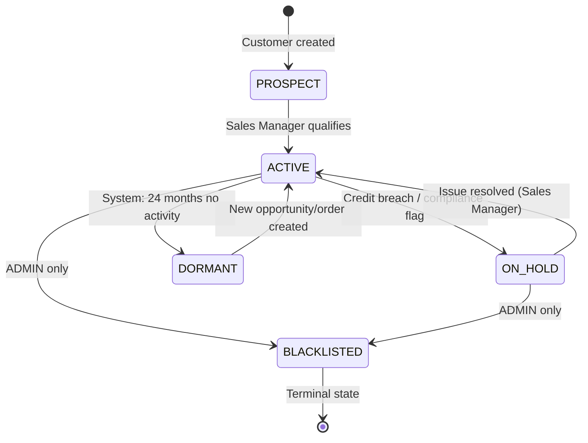
```mermaid
stateDiagram-v2
    [*] --> PROSPECT : Customer created
    PROSPECT --> ACTIVE : Sales Manager qualifies
    ACTIVE --> ON_HOLD : Credit breach / compliance flag
    ON_HOLD --> ACTIVE : Issue resolved (Sales Manager)
    ACTIVE --> DORMANT : System: 24 months no activity
    DORMANT --> ACTIVE : New opportunity/order created
    ACTIVE --> BLACKLISTED : ADMIN only
    ON_HOLD --> BLACKLISTED : ADMIN only
    BLACKLISTED --> [*] : Terminal state
```

**Invalid Transition Handling:** Error `CRM_CUST_ERR_01` (422) if attempting to transition BLACKLISTED to ACTIVE.

## 2. Opportunity State Machine
**Entity**: `crm_opportunities` | **Column**: `stage VARCHAR(20)`

**States:**
- `PROSPECTING`: Initial discovery phase.
- `QUALIFICATION`: Assessing customer fit and budget.
- `PROPOSAL`: Formal quotation presented.
- `NEGOTIATION`: Adjusting terms and pricing.
- `CLOSED_WON`: Deal successfully closed.
- `CLOSED_LOST`: Deal lost to competitor or cancelled.
- `ON_HOLD`: Deal temporarily paused.

**Transitions:**
| From State | Event/Trigger | To State | Actor | Business Rules Checked | Events Fired |
|---|---|---|---|---|---|
| [*] | Opportunity identified | PROSPECTING | Sales Rep | Valid Customer | OpportunityCreatedEvent |
| PROSPECTING | Budget confirmed | QUALIFICATION | Sales Rep | Budget > 0 | - |
| QUALIFICATION | Quote generated | PROPOSAL | Sales Rep | Quote attached | - |
| PROPOSAL | Customer objects | NEGOTIATION | Sales Rep | - | - |
| PROPOSAL, NEGOTIATION | Deal won | CLOSED_WON | Sales Manager | Quote signed | OpportunityWonEvent |
| PROSPECTING, QUALIFICATION, PROPOSAL, NEGOTIATION | Deal lost | CLOSED_LOST | Sales Rep | Lost reason provided | OpportunityLostEvent |
| Any open stage | Pause | ON_HOLD | Sales Rep | - | - |
| ON_HOLD | Resume | Previous Stage | Sales Rep | - | - |

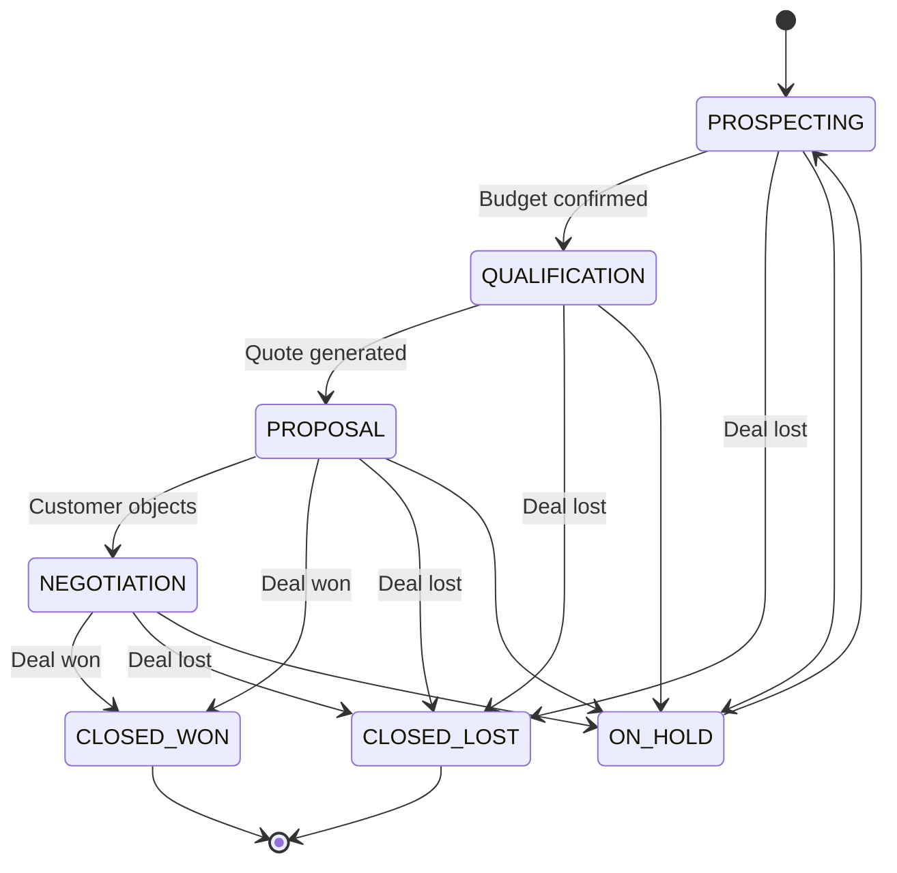
```mermaid
stateDiagram-v2
    [*] --> PROSPECTING
    PROSPECTING --> QUALIFICATION : Budget confirmed
    QUALIFICATION --> PROPOSAL : Quote generated
    PROPOSAL --> NEGOTIATION : Customer objects
    PROPOSAL --> CLOSED_WON : Deal won
    NEGOTIATION --> CLOSED_WON : Deal won
    PROSPECTING --> CLOSED_LOST : Deal lost
    QUALIFICATION --> CLOSED_LOST : Deal lost
    PROPOSAL --> CLOSED_LOST : Deal lost
    NEGOTIATION --> CLOSED_LOST : Deal lost
    PROSPECTING --> ON_HOLD
    QUALIFICATION --> ON_HOLD
    PROPOSAL --> ON_HOLD
    NEGOTIATION --> ON_HOLD
    ON_HOLD --> PROSPECTING
    CLOSED_WON --> [*]
    CLOSED_LOST --> [*]
```

**Invalid Transition Handling:** Error `CRM_OPP_ERR_02` (422) if transitioning to CLOSED_WON without an accepted quotation.

## 3. Quotation State Machine
**Entity**: `crm_quotations` | **Column**: `status VARCHAR(30)`

**States:**
- `DRAFT`: Quotation being built.
- `PENDING_APPROVAL`: Awaiting management approval.
- `APPROVED`: Approved internally.
- `SENT`: Sent to customer.
- `ACCEPTED`: Customer accepted.
- `REJECTED`: Customer rejected.
- `EXPIRED`: Validity period ended.
- `SUPERSEDED`: Replaced by a newer version.
- `CONVERTED`: Converted to a Sales Order.

**Transitions:**
| From State | Event/Trigger | To State | Actor | Business Rules Checked | Events Fired |
|---|---|---|---|---|---|
| [*] | Create Quote | DRAFT | Sales Rep | - | - |
| DRAFT | Submit (discount > 5%) | PENDING_APPROVAL | Sales Rep | Discount > 5% | QuoteApprovalRequestedEvent |
| DRAFT | Submit (discount <= 5%) | APPROVED | Auto | Discount <= 5% | QuoteApprovedEvent |
| PENDING_APPROVAL | Approve | APPROVED | Sales Manager | - | QuoteApprovedEvent |
| APPROVED | Send | SENT | Sales Rep | Valid email address | QuoteSentEvent |
| SENT | Accept | ACCEPTED | Customer/Sales | Within validity period | QuoteAcceptedEvent |
| SENT | Reject | REJECTED | Customer/Sales | - | QuoteRejectedEvent |
| SENT | Validity ends | EXPIRED | System | date > valid_until | QuoteExpiredEvent |
| Any | New Revision | SUPERSEDED | Sales Rep | - | - |
| ACCEPTED | Convert | CONVERTED | Sales Rep | - | QuotationConvertedEvent |

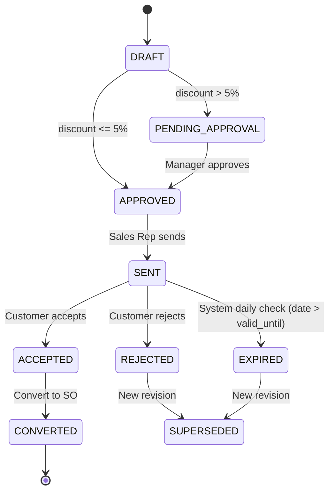
```mermaid
stateDiagram-v2
    [*] --> DRAFT
    DRAFT --> PENDING_APPROVAL : discount > 5%
    DRAFT --> APPROVED : discount <= 5%
    PENDING_APPROVAL --> APPROVED : Manager approves
    APPROVED --> SENT : Sales Rep sends
    SENT --> ACCEPTED : Customer accepts
    SENT --> REJECTED : Customer rejects
    SENT --> EXPIRED : System daily check (date > valid_until)
    ACCEPTED --> CONVERTED : Convert to SO
    REJECTED --> SUPERSEDED : New revision
    EXPIRED --> SUPERSEDED : New revision
    CONVERTED --> [*]
```

**Invalid Transition Handling:** Error `CRM_QT_ERR_03` (409) if converting an EXPIRED or REJECTED quotation.

## 4. Sales Order State Machine
**Entity**: `erp_sales_orders` | **Column**: `status VARCHAR(30)`

**States:**
- `DRAFT`: Initial order entry.
- `CONFIRMED`: Order formally accepted.
- `IN_PROCUREMENT`: Purchasing raw materials/components.
- `IN_PRODUCTION`: Manufacturing in progress.
- `IN_QUALITY`: Final quality checks.
- `READY_TO_SHIP`: Awaiting dispatch.
- `PARTIALLY_SHIPPED`: Some items dispatched.
- `SHIPPED`: Fully dispatched.
- `INVOICED`: Invoiced to customer.
- `CLOSED`: Order fully complete and paid.
- `CANCELLED`: Order cancelled.

**Transitions:**
| From State | Event/Trigger | To State | Actor | Business Rules Checked | Events Fired |
|---|---|---|---|---|---|
| [*] | Convert Quote | DRAFT | Sales Rep | Valid Quotation | - |
| DRAFT | Confirm | CONFIRMED | Sales Admin | Customer credit check | OrderConfirmedEvent |
| CONFIRMED | Start Sourcing | IN_PROCUREMENT | System/Planner | Material shortages exist | - |
| CONFIRMED, IN_PROCUREMENT | Release WO | IN_PRODUCTION | Planner | Materials available | - |
| IN_PRODUCTION | WO Complete | IN_QUALITY | System | Work Order Completed | - |
| IN_QUALITY | Inspection Pass | READY_TO_SHIP | QMS System | Inspection Passed | - |
| READY_TO_SHIP | Dispatch partial | PARTIALLY_SHIPPED | Logistics | - | PartialShipmentEvent |
| READY_TO_SHIP, PARTIALLY_SHIPPED | Dispatch all | SHIPPED | Logistics | All lines shipped | ShipmentDispatchedEvent |
| SHIPPED | Generate Invoice | INVOICED | Finance Auto | - | InvoiceGeneratedEvent |
| INVOICED | Payment Received | CLOSED | Finance | Invoice PAID | OrderClosedEvent |

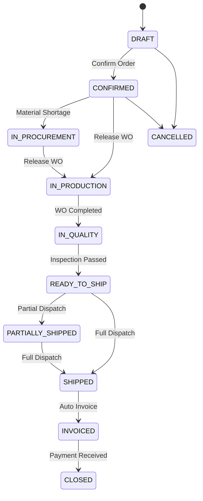
```mermaid
stateDiagram-v2
    [*] --> DRAFT
    DRAFT --> CONFIRMED : Confirm Order
    CONFIRMED --> IN_PROCUREMENT : Material Shortage
    CONFIRMED --> IN_PRODUCTION : Release WO
    IN_PROCUREMENT --> IN_PRODUCTION : Release WO
    IN_PRODUCTION --> IN_QUALITY : WO Completed
    IN_QUALITY --> READY_TO_SHIP : Inspection Passed
    READY_TO_SHIP --> PARTIALLY_SHIPPED : Partial Dispatch
    PARTIALLY_SHIPPED --> SHIPPED : Full Dispatch
    READY_TO_SHIP --> SHIPPED : Full Dispatch
    SHIPPED --> INVOICED : Auto Invoice
    INVOICED --> CLOSED : Payment Received
    DRAFT --> CANCELLED
    CONFIRMED --> CANCELLED
```

**Invalid Transition Handling:** Error `ERP_SO_ERR_05` (409) if attempting to cancel a SHIPPED or INVOICED order.

## 5. PDM Document State Machine
**Entity**: `pdm_documents` | **Column**: `status VARCHAR(20)`

**States:** DRAFT, IN_REVIEW, APPROVED, RELEASED, SUPERSEDED, OBSOLETE

**Transitions:**
| From State | Event/Trigger | To State | Actor | Business Rules Checked | Events Fired |
|---|---|---|---|---|---|
| [*] | Upload | DRAFT | Engineer | - | - |
| DRAFT | Request Review | IN_REVIEW | Engineer | Required fields present | - |
| IN_REVIEW | Approve | APPROVED | Lead Engineer | - | - |
| APPROVED | Release | RELEASED | Doc Controller | - | DocumentUploadedEvent |
| RELEASED | Revise | SUPERSEDED | System | New version released | - |
| RELEASED, SUPERSEDED | Obsolete | OBSOLETE | Doc Controller | - | - |

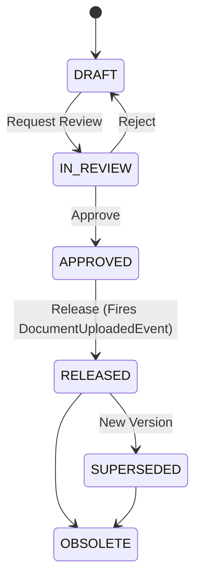
```mermaid
stateDiagram-v2
    [*] --> DRAFT
    DRAFT --> IN_REVIEW : Request Review
    IN_REVIEW --> APPROVED : Approve
    IN_REVIEW --> DRAFT : Reject
    APPROVED --> RELEASED : Release (Fires DocumentUploadedEvent)
    RELEASED --> SUPERSEDED : New Version
    RELEASED --> OBSOLETE
    SUPERSEDED --> OBSOLETE
```

**Invalid Transition Handling:** Error `PDM_DOC_ERR_01` (422) if modifying a RELEASED document (must create a new version).

## 6. Engineering Change Order (ECO) State Machine
**Entity**: `pdm_eco` | **Column**: `status VARCHAR(20)`

**States:** DRAFT, SUBMITTED, UNDER_REVIEW, APPROVED, IMPLEMENTED, CLOSED

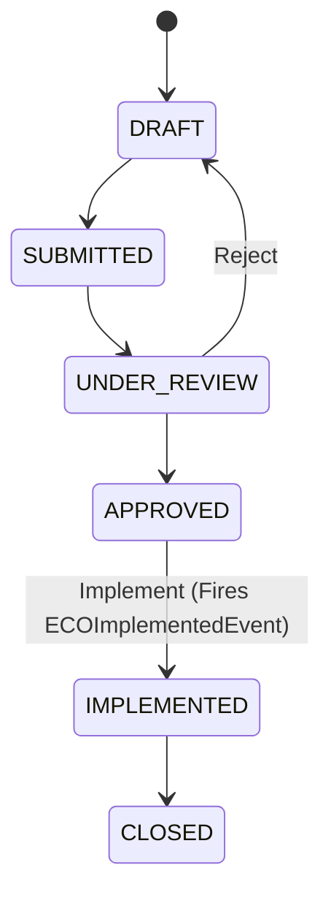
```mermaid
stateDiagram-v2
    [*] --> DRAFT
    DRAFT --> SUBMITTED
    SUBMITTED --> UNDER_REVIEW
    UNDER_REVIEW --> APPROVED
    UNDER_REVIEW --> DRAFT : Reject
    APPROVED --> IMPLEMENTED : Implement (Fires ECOImplementedEvent)
    IMPLEMENTED --> CLOSED
```

## 7. eBOM State Machine
**Entity**: `bom_ebom_headers` | **Column**: `status VARCHAR(20)`

**States:** DRAFT, IN_REVIEW, APPROVED, RELEASED, SUPERSEDED, OBSOLETE

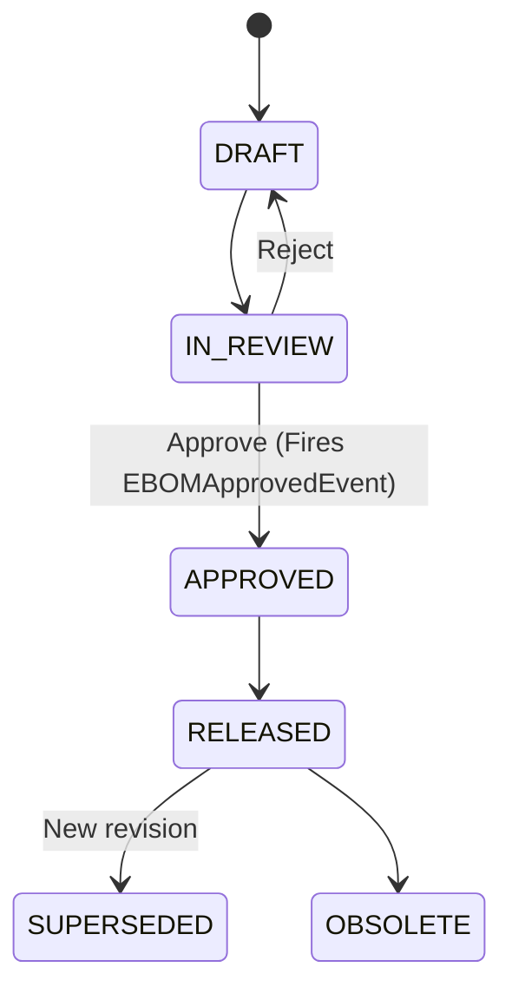
```mermaid
stateDiagram-v2
    [*] --> DRAFT
    DRAFT --> IN_REVIEW
    IN_REVIEW --> APPROVED : Approve (Fires EBOMApprovedEvent)
    IN_REVIEW --> DRAFT : Reject
    APPROVED --> RELEASED
    RELEASED --> SUPERSEDED : New revision
    RELEASED --> OBSOLETE
```

## 8. mBOM State Machine
**Entity**: `bom_mbom_headers` | **Column**: `status VARCHAR(20)`

**States:** DRAFT, IN_REVIEW, APPROVED, RELEASED, SUPERSEDED, OBSOLETE

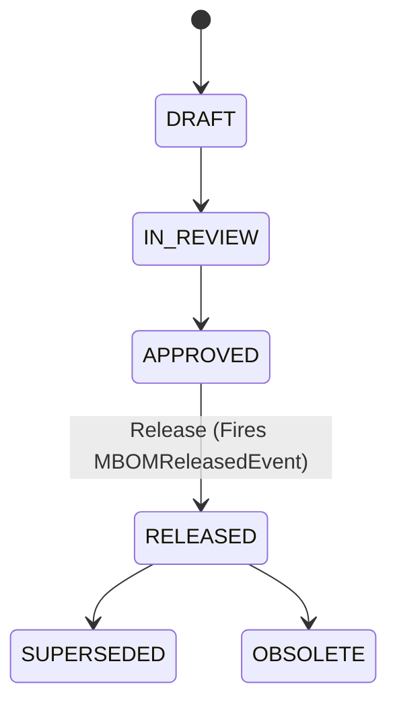
```mermaid
stateDiagram-v2
    [*] --> DRAFT
    DRAFT --> IN_REVIEW
    IN_REVIEW --> APPROVED
    APPROVED --> RELEASED : Release (Fires MBOMReleasedEvent)
    RELEASED --> SUPERSEDED
    RELEASED --> OBSOLETE
```

## 9. BOM Transformation State Machine
**Entity**: `bom_transformations` | **Column**: `status VARCHAR(20)`

**States:** INITIATED, IN_PROGRESS, COMPLETED, FAILED, CANCELLED

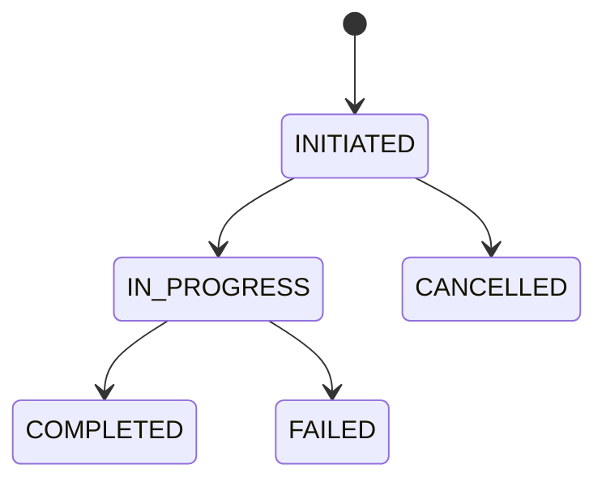
```mermaid
stateDiagram-v2
    [*] --> INITIATED
    INITIATED --> IN_PROGRESS
    IN_PROGRESS --> COMPLETED
    IN_PROGRESS --> FAILED
    INITIATED --> CANCELLED
```

## 10. Purchase Requisition State Machine
**Entity**: `scm_purchase_requisitions` | **Column**: `status VARCHAR(20)`

**States:** DRAFT, SUBMITTED, APPROVED, CONVERTED_TO_PO, CANCELLED, REJECTED

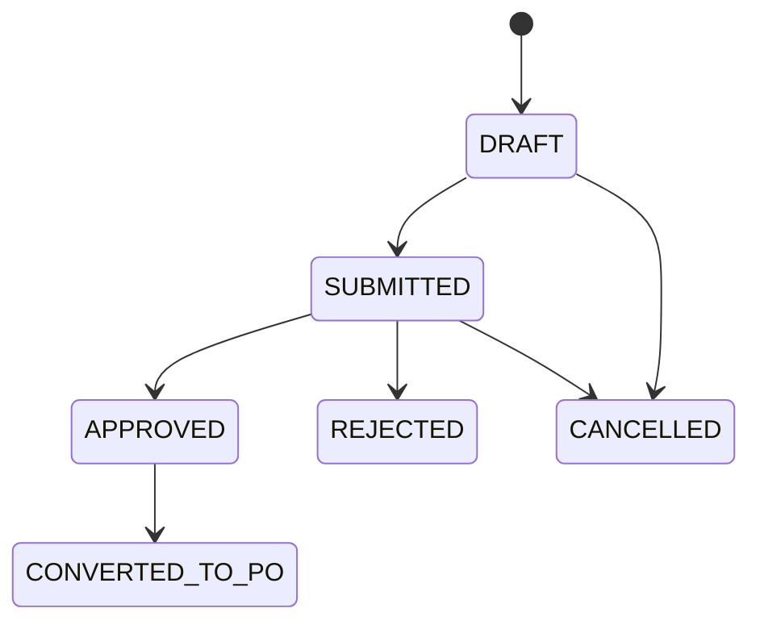
```mermaid
stateDiagram-v2
    [*] --> DRAFT
    DRAFT --> SUBMITTED
    SUBMITTED --> APPROVED
    SUBMITTED --> REJECTED
    APPROVED --> CONVERTED_TO_PO
    DRAFT --> CANCELLED
    SUBMITTED --> CANCELLED
```

## 11. Purchase Order State Machine
**Entity**: `scm_purchase_orders` | **Column**: `status VARCHAR(30)`

**States:** DRAFT, PENDING_APPROVAL, APPROVED, SENT, PARTIALLY_RECEIVED, RECEIVED, CLOSED, CANCELLED

**Approval Branching:**
- ≤¥500K: DRAFT → APPROVED (auto)
- ¥500K-5M: DRAFT → PENDING_APPROVAL → APPROVED (PROCUREMENT_MANAGER)
- \>¥5M: DRAFT → PENDING_APPROVAL → APPROVED (PLANT_MANAGER)

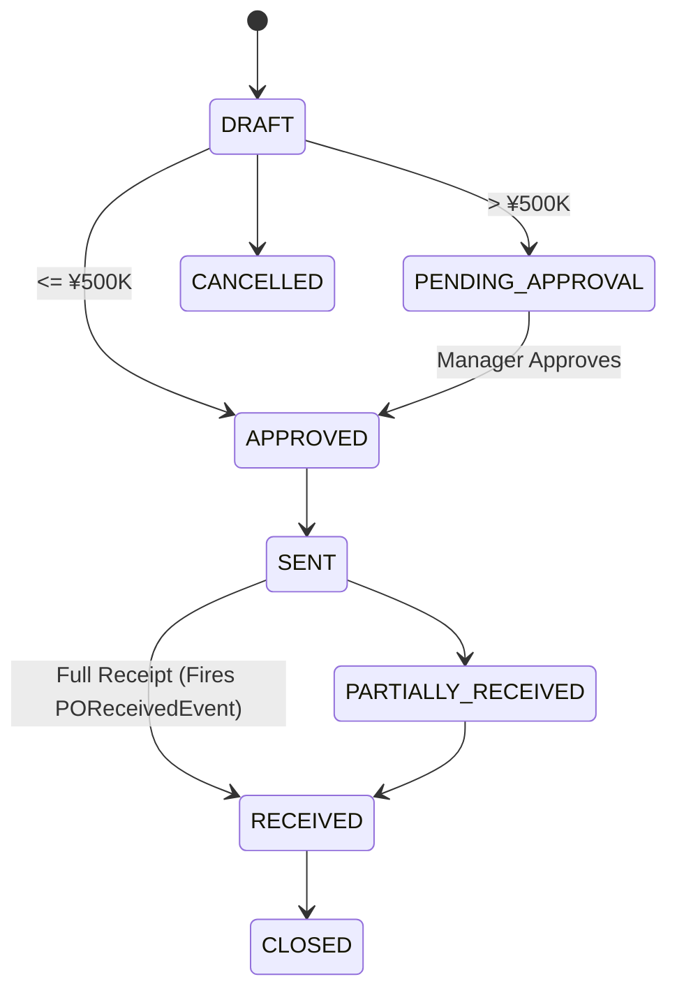
```mermaid
stateDiagram-v2
    [*] --> DRAFT
    DRAFT --> APPROVED : <= ¥500K
    DRAFT --> PENDING_APPROVAL : > ¥500K
    PENDING_APPROVAL --> APPROVED : Manager Approves
    APPROVED --> SENT
    SENT --> PARTIALLY_RECEIVED
    SENT --> RECEIVED : Full Receipt (Fires POReceivedEvent)
    PARTIALLY_RECEIVED --> RECEIVED
    RECEIVED --> CLOSED
    DRAFT --> CANCELLED
```

## 12. Work Order State Machine
**Entity**: `prd_work_orders` | **Column**: `status VARCHAR(20)`

**States:** DRAFT, RELEASED, IN_PROGRESS, ON_HOLD, COMPLETED, QUALITY_CHECK, CLOSED, CANCELLED

**ON_HOLD sub-reasons:** MATERIAL_SHORTAGE, QUALITY_HOLD, EQUIPMENT_BREAKDOWN, OPERATOR_ABSENT

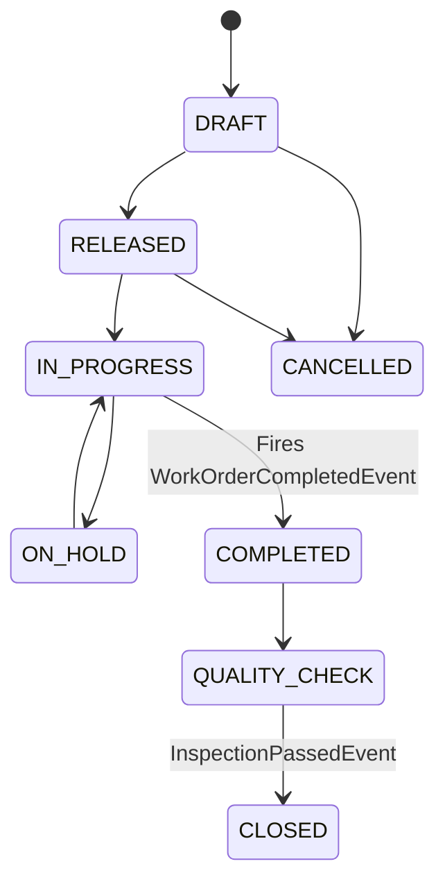
```mermaid
stateDiagram-v2
    [*] --> DRAFT
    DRAFT --> RELEASED
    RELEASED --> IN_PROGRESS
    IN_PROGRESS --> ON_HOLD
    ON_HOLD --> IN_PROGRESS
    IN_PROGRESS --> COMPLETED : Fires WorkOrderCompletedEvent
    COMPLETED --> QUALITY_CHECK
    QUALITY_CHECK --> CLOSED : InspectionPassedEvent
    DRAFT --> CANCELLED
    RELEASED --> CANCELLED
```

## 13. Work Order Operation State Machine
**Entity**: `prd_work_order_operations` | **Column**: `status VARCHAR(20)`

**States:** NOT_STARTED, IN_PROGRESS, COMPLETED, ON_HOLD, SKIPPED

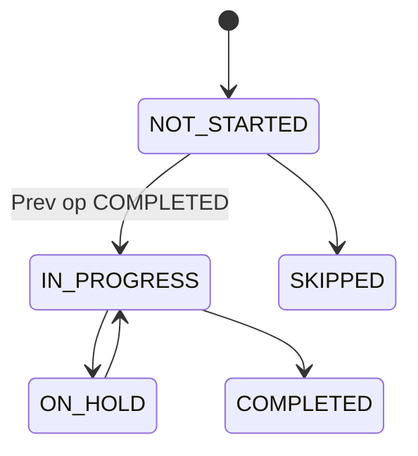
```mermaid
stateDiagram-v2
    [*] --> NOT_STARTED
    NOT_STARTED --> IN_PROGRESS : Prev op COMPLETED
    IN_PROGRESS --> ON_HOLD
    ON_HOLD --> IN_PROGRESS
    IN_PROGRESS --> COMPLETED
    NOT_STARTED --> SKIPPED
```

## 14. Quality Inspection State Machine
**Entity**: `qms_inspections` | **Column**: `status VARCHAR(30)`

**States:** PENDING, IN_PROGRESS, PASSED, FAILED, CONDITIONALLY_PASSED, CANCELLED

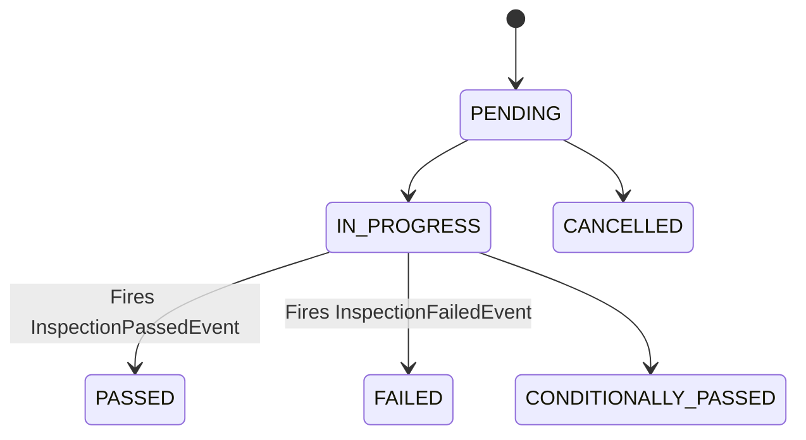
```mermaid
stateDiagram-v2
    [*] --> PENDING
    PENDING --> IN_PROGRESS
    IN_PROGRESS --> PASSED : Fires InspectionPassedEvent
    IN_PROGRESS --> FAILED : Fires InspectionFailedEvent
    IN_PROGRESS --> CONDITIONALLY_PASSED
    PENDING --> CANCELLED
```

## 15. Non-Conformance Report (NCR) State Machine
**Entity**: `qms_ncr` | **Column**: `status VARCHAR(30)`

**States:** OPEN, UNDER_REVIEW, DISPOSITION_APPROVED, IN_REWORK, IN_RETURN, VERIFIED, CLOSED
**Dispositions:** REWORK, SCRAP, USE_AS_IS, RETURN_TO_VENDOR

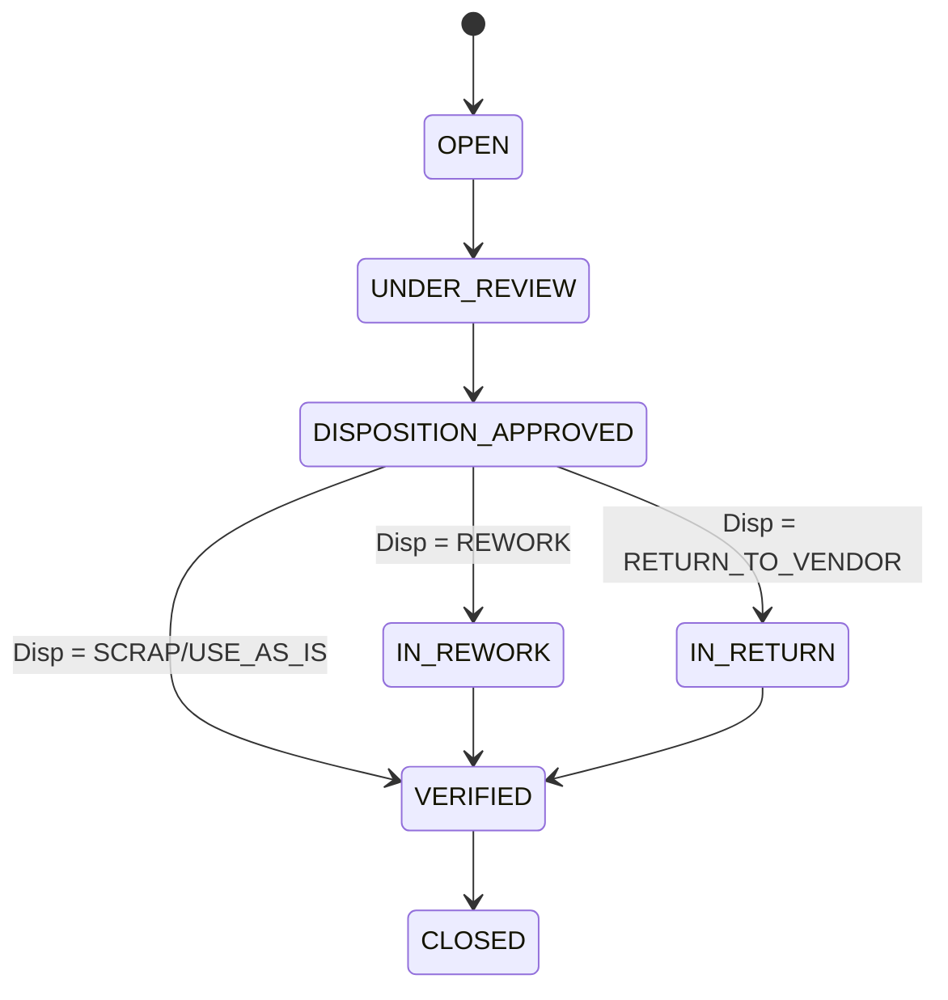
```mermaid
stateDiagram-v2
    [*] --> OPEN
    OPEN --> UNDER_REVIEW
    UNDER_REVIEW --> DISPOSITION_APPROVED
    DISPOSITION_APPROVED --> IN_REWORK : Disp = REWORK
    DISPOSITION_APPROVED --> IN_RETURN : Disp = RETURN_TO_VENDOR
    DISPOSITION_APPROVED --> VERIFIED : Disp = SCRAP/USE_AS_IS
    IN_REWORK --> VERIFIED
    IN_RETURN --> VERIFIED
    VERIFIED --> CLOSED
```

## 16. Shipment State Machine
**Entity**: `erp_shipments` | **Column**: `status VARCHAR(30)`

**States:** PLANNED, DISPATCHED, IN_TRANSIT, DELIVERED, CONFIRMED_BY_CUSTOMER

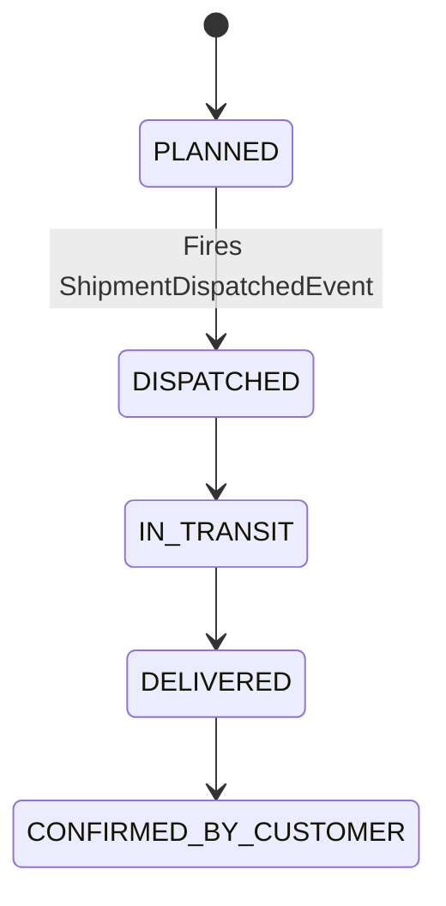
```mermaid
stateDiagram-v2
    [*] --> PLANNED
    PLANNED --> DISPATCHED : Fires ShipmentDispatchedEvent
    DISPATCHED --> IN_TRANSIT
    IN_TRANSIT --> DELIVERED
    DELIVERED --> CONFIRMED_BY_CUSTOMER
```

## 17. Invoice State Machine
**Entity**: `erp_invoices` | **Column**: `status VARCHAR(20)`

**States:** DRAFT, ISSUED, PARTIALLY_PAID, PAID, OVERDUE, CANCELLED

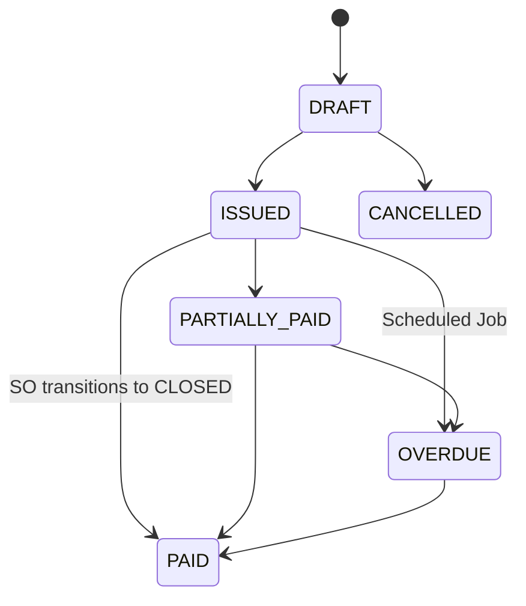
```mermaid
stateDiagram-v2
    [*] --> DRAFT
    DRAFT --> ISSUED
    ISSUED --> PARTIALLY_PAID
    ISSUED --> PAID : SO transitions to CLOSED
    ISSUED --> OVERDUE : Scheduled Job
    PARTIALLY_PAID --> PAID
    PARTIALLY_PAID --> OVERDUE
    OVERDUE --> PAID
    DRAFT --> CANCELLED
```

## 18. Supplier State Machine
**Entity**: `scm_vendors` | **Column**: `status VARCHAR(20)`

**States:** ACTIVE, ON_HOLD, BLACKLISTED

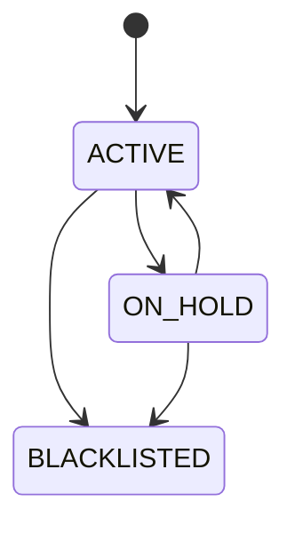
```mermaid
stateDiagram-v2
    [*] --> ACTIVE
    ACTIVE --> ON_HOLD
    ON_HOLD --> ACTIVE
    ACTIVE --> BLACKLISTED
    ON_HOLD --> BLACKLISTED
```

## 19. AI Query State Machine
**Entity**: `ai_query_log` | **Column**: `status VARCHAR(20)`

**States:** RECEIVED, PROCESSING, COMPLETED, FAILED, FLAGGED

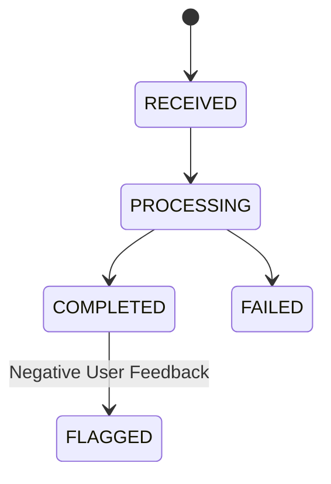
```mermaid
stateDiagram-v2
    [*] --> RECEIVED
    RECEIVED --> PROCESSING
    PROCESSING --> COMPLETED
    PROCESSING --> FAILED
    COMPLETED --> FLAGGED : Negative User Feedback
```

---

## State Transition Event Summary
A consolidated table of all domain events fired by state transitions:
| Event Name | Fired When | Published By | Consumers | Effect |
|---|---|---|---|---|
| OpportunityWonEvent | Opportunity stage -> CLOSED_WON | crm_opportunities | Quotation Service | Unlocks Quotation conversion |
| QuotationConvertedEvent | Quotation status -> CONVERTED | crm_quotations | Order Service | Triggers SO Draft creation |
| OrderConfirmedEvent | SalesOrder status -> CONFIRMED | erp_sales_orders | Planning Service | Initiates MRP/Procurement |
| StockShortfallEvent | Material needed > On-hand | inv_stock | Procurement Service | Triggers Purchase Requisition |
| LowStockAlertEvent | On-hand <= min_stock | inv_stock | Procurement Service | Triggers Notification/Replenishment |
| POReceivedEvent | PurchaseOrder status -> RECEIVED | scm_purchase_orders | Inventory Service | Updates Inventory Stock levels |
| EBOMApprovedEvent | eBOM status -> APPROVED | bom_ebom_headers | BOM Service | Enables mBOM Transformation |
| MBOMReleasedEvent | mBOM status -> RELEASED | bom_mbom_headers | Production Service| WO creation becomes available; updates standard_cost |
| WorkOrderCompletedEvent | WorkOrder status -> COMPLETED | prd_work_orders | QMS Service | Initiates Final Inspection |
| InspectionPassedEvent | Inspection status -> PASSED | qms_inspections | Order/Prod Service | Transitions WO/SO to closed/ready |
| InspectionFailedEvent | Inspection status -> FAILED | qms_inspections | QMS Service | Triggers NCR creation |
| NCRRaisedEvent | NCR created | qms_ncr | Production Service| Places associated WO ON_HOLD |
| ShipmentDispatchedEvent | Shipment status -> DISPATCHED | erp_shipments | Finance/Inv | Generates invoice; Goods issue |
| InvoiceGeneratedEvent | Invoice created | erp_invoices | Notification | Sends invoice to customer |
| DocumentUploadedEvent | Document status -> RELEASED | pdm_documents | AI Service | Triggers AI vector indexing |
| ECOImplementedEvent | ECO status -> IMPLEMENTED | pdm_eco | BOM Service | Triggers new eBOM revision |

## Cross-Module State Dependencies
A table showing which state in one module is a PREREQUISITE for an action in another module:
| Action | Required State | Entity | Module |
|---|---|---|---|
| Create Quotation | `Opportunity.stage = CLOSED_WON` | Opportunity | CRM |
| Create Sales Order | `Quotation.status = CONVERTED` | Quotation | CRM |
| Initiate mBOM Transformation | `eBOM.status = APPROVED` | eBOM | BOM |
| Create Work Order | `mBOM.status = RELEASED` AND `SalesOrder.status = CONFIRMED` | mBOM / SO | BOM / ERP |
| Final Inspection | `WorkOrder.status = COMPLETED` | WorkOrder | Production |
| Create Shipment | `SalesOrder.status = READY_TO_SHIP` AND no open CRITICAL/MAJOR NCRs | SO / NCR | ERP / QMS |
| Generate Invoice | `Shipment.status = DISPATCHED` | Shipment | ERP |
| Close Sales Order | `Invoice.status = PAID` | Invoice | ERP |
| Receive PO | `Vendor.status = ACTIVE` | Vendor | SCM |
| Dispatch Shipment | `Customer.status != ON_HOLD` AND `!= BLACKLISTED` | Customer | CRM |
| Create ECO | `Document.status = RELEASED` | Document | PDM |

## Invalid Transition Error Responses
Table showing the standard error responses for invalid state transitions:
| Attempted Transition | Error Code | HTTP Status | Error Message |
|---|---|---|---|
| RELEASED → DRAFT on eBOM | BOM_ERR_001 | 409 | 'eBOM is in RELEASED status and cannot be modified. Create a new revision or submit an ECO.' |
| Create WO when mBOM not RELEASED | PRD_ERR_001 | 422 | 'No RELEASED mBOM found for product SMW-HM-500. mBOM must be released before work orders can be created.' |
| CONFIRMED → DRAFT on SO | ERP_ERR_002 | 409 | 'Sales Order is already CONFIRMED and cannot revert to DRAFT.' |
| SHIPPED → CANCELLED on SO | ERP_ERR_003 | 409 | 'Cannot cancel a SHIPPED Sales Order. Process a return instead.' |
| ISSUED → CANCELLED on Invoice | FIN_ERR_001 | 409 | 'Cannot cancel an ISSUED invoice. Please issue a Credit Note.' |
| PENDING → PASSED on Inspection | QMS_ERR_002 | 422 | 'Inspection must be IN_PROGRESS before it can be marked as PASSED.' |
| CLOSED → IN_PROGRESS on WO | PRD_ERR_005 | 409 | 'Work Order is CLOSED and cannot be reopened.' |
| SUBMITTED → CONVERTED_TO_PO on PR | SCM_ERR_004 | 422 | 'Purchase Requisition must be APPROVED before conversion to PO.' |
| DRAFT → SENT on Quotation | CRM_ERR_006 | 422 | 'Quotation must be APPROVED before it can be SENT to customer.' |
| INVOICED → SHIPPED on SO | ERP_ERR_008 | 409 | 'Sales Order is already INVOICED. Cannot regress to SHIPPED.' |

## Scheduler-Driven Transitions
Some state transitions are triggered by scheduled jobs, not user actions:
| Job Name | Schedule | Transition | Entity |
|---|---|---|---|
| QuotationExpiryJob | Daily at 00:00 JST | SENT → EXPIRED when `valid_until` < today | `crm_quotations` |
| OverdueInvoiceJob | Daily at 07:00 JST | ISSUED → OVERDUE when `due_date` < today and status != PAID | `erp_invoices` |
| CustomerDormancyJob | Monthly on 1st | ACTIVE → DORMANT when no activity in 24 months | `crm_customers` |
| VendorRatingJob | 1st of each month | Recalculates `performance_rating` | `scm_vendors` |
| LowStockCheckJob | Every 6 hours | Fires `LowStockAlertEvent` when `on_hand` <= `min_stock` | `inv_stock` |
| StaleOpportunityJob | Daily | Flags opportunities with no update in 30 days (Moves to ON_HOLD) | `crm_opportunities` |
