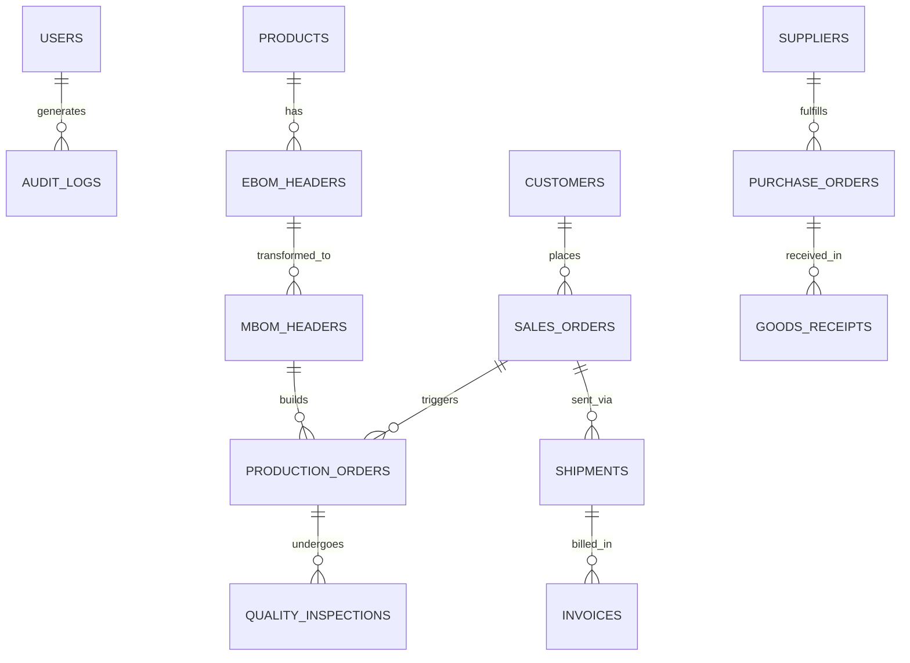
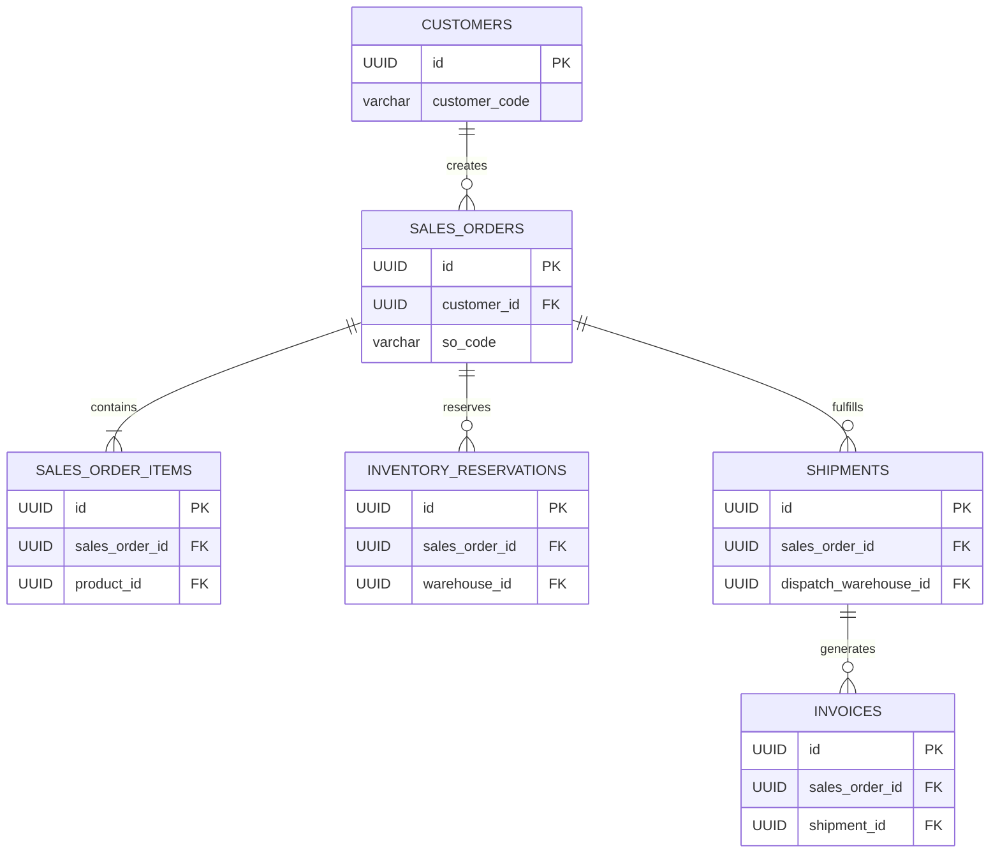
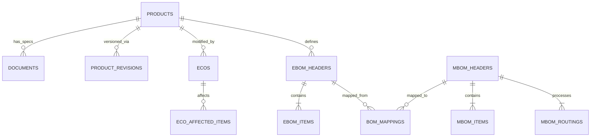
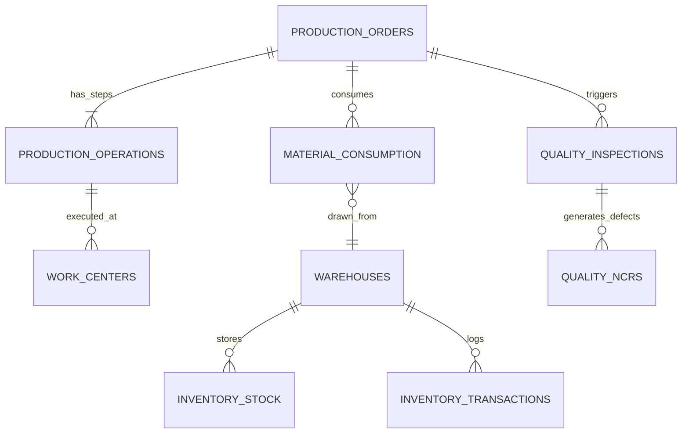
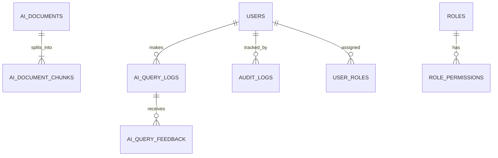

# PostgreSQL 16 Database Architecture & Schema Specification
## Siva Machine Works — Smart Manufacturing Digital Transformation Platform

### 1. Database Architecture & Design Principles

The database architecture for Siva Machine Works relies on PostgreSQL 16, utilizing its advanced relational features, strong consistency guarantees, and specialized extensions for vector search and identity generation.

#### Core Design Principles:
- **Standard Conventions:** All tables and columns use lowercase `snake_case`.
- **Primary Keys:** Every entity uses a UUID v4 as its primary key (`id UUID PRIMARY KEY DEFAULT gen_random_uuid()`).
- **Audit Columns:** Embedded across all transactional business entities to ensure traceability:
  - `created_at TIMESTAMPTZ NOT NULL DEFAULT CURRENT_TIMESTAMP`
  - `created_by UUID REFERENCES users(id)`
  - `updated_at TIMESTAMPTZ NOT NULL DEFAULT CURRENT_TIMESTAMP`
  - `updated_by UUID REFERENCES users(id)`
  - `deleted_at TIMESTAMPTZ NULL` (for soft deletes on applicable records)
- **Optimistic Locking:** The `version BIGINT NOT NULL DEFAULT 0` column is applied on transactional root aggregates to manage concurrent updates safely.
- **Foreign Key Strategy (Monolithic Consistency):** 
  - Strong foreign key constraints are enforced globally.
  - Inter-module relationships typically default to `ON DELETE RESTRICT`.
  - Owned child entities (e.g., lines within a document or items within an order) use `ON DELETE CASCADE`.
  - All foreign keys are indexed for JOIN performance.
- **Extensions Used:**
  - `uuid-ossp` and `pgcrypto` for UUID generation and hashing.
  - `vector` for pgvector support (AI embeddings).
  - `pg_trgm` for text search/trigram similarity.
- **Data Types:**
  - **Money & Pricing:** `NUMERIC(15, 2)` mapped to JPY, USD, or EUR, enforced with `CHECK (value >= 0)`.
  - **Quantities & Metrics:** `NUMERIC(12, 4)` for continuous dimensions/weight/bulk, and `INTEGER` for discrete unit counts.

```sql
-- Initialization of required extensions
CREATE EXTENSION IF NOT EXISTS "uuid-ossp";
CREATE EXTENSION IF NOT EXISTS "pgcrypto";
CREATE EXTENSION IF NOT EXISTS "vector";
CREATE EXTENSION IF NOT EXISTS "pg_trgm";
```

---

### 2. Comprehensive Data Dictionary & DDL Specifications by Domain

#### Domain 1: Identity, RBAC & Governance

```sql
CREATE TABLE users (
    id UUID PRIMARY KEY DEFAULT gen_random_uuid(),
    username VARCHAR(100) UNIQUE NOT NULL,
    email VARCHAR(255) UNIQUE NOT NULL,
    password_hash VARCHAR(255) NOT NULL,
    full_name VARCHAR(255) NOT NULL,
    department VARCHAR(100),
    job_title VARCHAR(100),
    plant_location VARCHAR(50) CHECK (plant_location IN ('Osaka', 'Nagoya', 'Penang', 'Global')),
    is_active BOOLEAN DEFAULT true,
    failed_login_attempts INT DEFAULT 0,
    locked_until TIMESTAMPTZ,
    version BIGINT NOT NULL DEFAULT 0,
    created_at TIMESTAMPTZ NOT NULL DEFAULT CURRENT_TIMESTAMP,
    created_by UUID REFERENCES users(id),
    updated_at TIMESTAMPTZ NOT NULL DEFAULT CURRENT_TIMESTAMP,
    updated_by UUID REFERENCES users(id),
    deleted_at TIMESTAMPTZ
);
CREATE INDEX idx_users_email ON users(email);
CREATE INDEX idx_users_plant ON users(plant_location);

CREATE TABLE roles (
    id UUID PRIMARY KEY DEFAULT gen_random_uuid(),
    code VARCHAR(50) UNIQUE NOT NULL,
    name VARCHAR(100) NOT NULL,
    description TEXT,
    is_system BOOLEAN DEFAULT false,
    created_at TIMESTAMPTZ NOT NULL DEFAULT CURRENT_TIMESTAMP,
    created_by UUID REFERENCES users(id),
    updated_at TIMESTAMPTZ NOT NULL DEFAULT CURRENT_TIMESTAMP,
    updated_by UUID REFERENCES users(id),
    deleted_at TIMESTAMPTZ
);

CREATE TABLE permissions (
    id UUID PRIMARY KEY DEFAULT gen_random_uuid(),
    code VARCHAR(100) UNIQUE NOT NULL,
    module VARCHAR(50) NOT NULL,
    action VARCHAR(50) NOT NULL,
    description TEXT
);
CREATE INDEX idx_permissions_module ON permissions(module);

CREATE TABLE user_roles (
    user_id UUID REFERENCES users(id) ON DELETE CASCADE,
    role_id UUID REFERENCES roles(id) ON DELETE CASCADE,
    assigned_at TIMESTAMPTZ NOT NULL DEFAULT CURRENT_TIMESTAMP,
    assigned_by UUID REFERENCES users(id),
    PRIMARY KEY (user_id, role_id)
);

CREATE TABLE role_permissions (
    role_id UUID REFERENCES roles(id) ON DELETE CASCADE,
    permission_id UUID REFERENCES permissions(id) ON DELETE CASCADE,
    assigned_at TIMESTAMPTZ NOT NULL DEFAULT CURRENT_TIMESTAMP,
    PRIMARY KEY (role_id, permission_id)
);

CREATE TABLE audit_logs (
    id BIGSERIAL PRIMARY KEY,
    user_id UUID REFERENCES users(id),
    action VARCHAR(100) NOT NULL,
    entity_name VARCHAR(100) NOT NULL,
    entity_id UUID NOT NULL,
    old_values JSONB,
    new_values JSONB,
    ip_address INET,
    user_agent TEXT,
    correlation_id UUID,
    timestamp TIMESTAMPTZ NOT NULL DEFAULT CURRENT_TIMESTAMP
);
CREATE INDEX idx_audit_logs_entity ON audit_logs(entity_name, entity_id);
CREATE INDEX idx_audit_logs_user ON audit_logs(user_id);
CREATE INDEX idx_audit_logs_timestamp ON audit_logs(timestamp);

CREATE TABLE notifications (
    id UUID PRIMARY KEY DEFAULT gen_random_uuid(),
    recipient_id UUID REFERENCES users(id) ON DELETE CASCADE,
    title VARCHAR(255) NOT NULL,
    message TEXT NOT NULL,
    level VARCHAR(20) CHECK (level IN ('INFO', 'WARNING', 'CRITICAL')),
    category VARCHAR(50),
    entity_type VARCHAR(100),
    entity_id UUID,
    is_read BOOLEAN DEFAULT false,
    read_at TIMESTAMPTZ,
    created_at TIMESTAMPTZ NOT NULL DEFAULT CURRENT_TIMESTAMP
);
CREATE INDEX idx_notifications_recipient ON notifications(recipient_id, is_read);
```

#### Domain 2: CRM & Customer Management

```sql
CREATE TABLE customers (
    id UUID PRIMARY KEY DEFAULT gen_random_uuid(),
    customer_code VARCHAR(50) UNIQUE NOT NULL,
    company_name VARCHAR(255) NOT NULL,
    tax_id VARCHAR(100),
    country VARCHAR(100),
    address TEXT,
    industry VARCHAR(100),
    tier VARCHAR(10) CHECK (tier IN ('A', 'B', 'C')),
    status VARCHAR(20) CHECK (status IN ('PROSPECT', 'ACTIVE', 'ON_HOLD', 'DORMANT', 'BLACKLISTED')),
    credit_limit NUMERIC(15, 2) CHECK (credit_limit >= 0),
    payment_terms VARCHAR(100),
    version BIGINT NOT NULL DEFAULT 0,
    created_at TIMESTAMPTZ NOT NULL DEFAULT CURRENT_TIMESTAMP,
    created_by UUID REFERENCES users(id),
    updated_at TIMESTAMPTZ NOT NULL DEFAULT CURRENT_TIMESTAMP,
    updated_by UUID REFERENCES users(id),
    deleted_at TIMESTAMPTZ
);
CREATE INDEX idx_customers_code ON customers(customer_code);
CREATE INDEX idx_customers_status ON customers(status);

CREATE TABLE customer_contacts (
    id UUID PRIMARY KEY DEFAULT gen_random_uuid(),
    customer_id UUID REFERENCES customers(id) ON DELETE CASCADE,
    first_name VARCHAR(100) NOT NULL,
    last_name VARCHAR(100) NOT NULL,
    email VARCHAR(255),
    phone VARCHAR(50),
    job_title VARCHAR(100),
    department VARCHAR(100),
    is_primary BOOLEAN DEFAULT false,
    is_active BOOLEAN DEFAULT true,
    created_at TIMESTAMPTZ NOT NULL DEFAULT CURRENT_TIMESTAMP,
    created_by UUID REFERENCES users(id),
    updated_at TIMESTAMPTZ NOT NULL DEFAULT CURRENT_TIMESTAMP,
    updated_by UUID REFERENCES users(id),
    deleted_at TIMESTAMPTZ
);
CREATE INDEX idx_customer_contacts_customer ON customer_contacts(customer_id);

CREATE TABLE crm_opportunities (
    id UUID PRIMARY KEY DEFAULT gen_random_uuid(),
    opportunity_code VARCHAR(50) UNIQUE NOT NULL,
    customer_id UUID REFERENCES customers(id) ON DELETE RESTRICT,
    primary_contact_id UUID REFERENCES customer_contacts(id),
    product_id UUID, -- Forward declared, referenced in Domain 3
    stage VARCHAR(30) CHECK (stage IN ('PROSPECTING', 'QUALIFICATION', 'PROPOSAL', 'NEGOTIATION', 'CLOSED_WON', 'CLOSED_LOST', 'ON_HOLD')),
    estimated_value NUMERIC(15, 2) CHECK (estimated_value >= 0),
    currency VARCHAR(10) DEFAULT 'JPY',
    probability_pct NUMERIC(5, 2) CHECK (probability_pct BETWEEN 0 AND 100),
    expected_close_date DATE,
    actual_close_date DATE,
    lost_reason TEXT,
    assigned_rep_id UUID REFERENCES users(id),
    version BIGINT NOT NULL DEFAULT 0,
    created_at TIMESTAMPTZ NOT NULL DEFAULT CURRENT_TIMESTAMP,
    created_by UUID REFERENCES users(id),
    updated_at TIMESTAMPTZ NOT NULL DEFAULT CURRENT_TIMESTAMP,
    updated_by UUID REFERENCES users(id),
    deleted_at TIMESTAMPTZ
);
CREATE INDEX idx_crm_opps_customer ON crm_opportunities(customer_id);
CREATE INDEX idx_crm_opps_stage ON crm_opportunities(stage);

CREATE TABLE service_requests (
    id UUID PRIMARY KEY DEFAULT gen_random_uuid(),
    request_code VARCHAR(50) UNIQUE NOT NULL,
    customer_id UUID REFERENCES customers(id) ON DELETE RESTRICT,
    product_id UUID, -- Forward declared
    machine_serial_no VARCHAR(100),
    priority VARCHAR(20) CHECK (priority IN ('LOW', 'MEDIUM', 'HIGH', 'CRITICAL')),
    status VARCHAR(30) CHECK (status IN ('OPEN', 'ASSIGNED', 'IN_PROGRESS', 'RESOLVED', 'CLOSED')),
    reported_issue TEXT NOT NULL,
    resolution_notes TEXT,
    assigned_technician_id UUID REFERENCES users(id),
    version BIGINT NOT NULL DEFAULT 0,
    created_at TIMESTAMPTZ NOT NULL DEFAULT CURRENT_TIMESTAMP,
    created_by UUID REFERENCES users(id),
    updated_at TIMESTAMPTZ NOT NULL DEFAULT CURRENT_TIMESTAMP,
    updated_by UUID REFERENCES users(id),
    deleted_at TIMESTAMPTZ
);
CREATE INDEX idx_service_reqs_customer ON service_requests(customer_id);
CREATE INDEX idx_service_reqs_status ON service_requests(status);
```

#### Domain 3: Products, PDM & Document Management

```sql
CREATE TABLE products (
    id UUID PRIMARY KEY DEFAULT gen_random_uuid(),
    product_code VARCHAR(50) UNIQUE NOT NULL,
    name VARCHAR(255) NOT NULL,
    category VARCHAR(100),
    description TEXT,
    uom VARCHAR(20) DEFAULT 'EA',
    list_price NUMERIC(15, 2) CHECK (list_price >= 0),
    standard_cost NUMERIC(15, 2) CHECK (standard_cost >= 0),
    floor_price NUMERIC(15, 2) CHECK (floor_price >= 0),
    lead_time_weeks INT CHECK (lead_time_weeks >= 0),
    weight_kg NUMERIC(12, 4),
    hs_code VARCHAR(50),
    status VARCHAR(30) CHECK (status IN ('ACTIVE', 'INACTIVE', 'DISCONTINUED', 'UNDER_REVISION')),
    version BIGINT NOT NULL DEFAULT 0,
    created_at TIMESTAMPTZ NOT NULL DEFAULT CURRENT_TIMESTAMP,
    created_by UUID REFERENCES users(id),
    updated_at TIMESTAMPTZ NOT NULL DEFAULT CURRENT_TIMESTAMP,
    updated_by UUID REFERENCES users(id),
    deleted_at TIMESTAMPTZ
);
CREATE INDEX idx_products_code ON products(product_code);

-- Cross-schema FKs backfill
ALTER TABLE crm_opportunities ADD CONSTRAINT fk_opp_product FOREIGN KEY (product_id) REFERENCES products(id);
ALTER TABLE service_requests ADD CONSTRAINT fk_srv_product FOREIGN KEY (product_id) REFERENCES products(id);

CREATE TABLE product_revisions (
    id UUID PRIMARY KEY DEFAULT gen_random_uuid(),
    product_id UUID REFERENCES products(id) ON DELETE CASCADE,
    revision_code VARCHAR(20) NOT NULL,
    effective_date DATE,
    release_notes TEXT,
    status VARCHAR(30) CHECK (status IN ('UNDER_REVISION', 'RELEASED', 'SUPERSEDED')),
    approved_by UUID REFERENCES users(id),
    approved_at TIMESTAMPTZ,
    version BIGINT NOT NULL DEFAULT 0,
    created_at TIMESTAMPTZ NOT NULL DEFAULT CURRENT_TIMESTAMP,
    created_by UUID REFERENCES users(id),
    updated_at TIMESTAMPTZ NOT NULL DEFAULT CURRENT_TIMESTAMP,
    updated_by UUID REFERENCES users(id),
    deleted_at TIMESTAMPTZ,
    UNIQUE (product_id, revision_code)
);

CREATE TABLE documents (
    id UUID PRIMARY KEY DEFAULT gen_random_uuid(),
    document_number VARCHAR(100) UNIQUE NOT NULL,
    title VARCHAR(255) NOT NULL,
    doc_type VARCHAR(50) CHECK (doc_type IN ('DRAWING_3D', 'DRAWING_2D', 'SPEC', 'MANUAL_ASSEMBLY', 'MANUAL_MAINTENANCE', 'SCHEMATIC_ELECTRICAL', 'SCHEMATIC_HYDRAULIC', 'TEST_PROCEDURE', 'CERTIFICATE', 'BOM_DOCUMENT')),
    product_id UUID REFERENCES products(id) ON DELETE RESTRICT,
    is_restricted BOOLEAN DEFAULT false,
    version BIGINT NOT NULL DEFAULT 0,
    created_at TIMESTAMPTZ NOT NULL DEFAULT CURRENT_TIMESTAMP,
    created_by UUID REFERENCES users(id),
    updated_at TIMESTAMPTZ NOT NULL DEFAULT CURRENT_TIMESTAMP,
    updated_by UUID REFERENCES users(id),
    deleted_at TIMESTAMPTZ
);
CREATE INDEX idx_docs_product ON documents(product_id);

CREATE TABLE document_versions (
    id UUID PRIMARY KEY DEFAULT gen_random_uuid(),
    document_id UUID REFERENCES documents(id) ON DELETE CASCADE,
    version_number INT NOT NULL,
    revision_code VARCHAR(20),
    s3_bucket VARCHAR(100),
    s3_key VARCHAR(500),
    file_name VARCHAR(255),
    file_size_bytes BIGINT,
    mime_type VARCHAR(100),
    file_hash_sha256 VARCHAR(64),
    status VARCHAR(30) CHECK (status IN ('DRAFT', 'IN_REVIEW', 'APPROVED', 'RELEASED', 'SUPERSEDED', 'OBSOLETE')),
    approved_by UUID REFERENCES users(id),
    approved_at TIMESTAMPTZ,
    created_at TIMESTAMPTZ NOT NULL DEFAULT CURRENT_TIMESTAMP,
    created_by UUID REFERENCES users(id),
    updated_at TIMESTAMPTZ NOT NULL DEFAULT CURRENT_TIMESTAMP,
    updated_by UUID REFERENCES users(id),
    deleted_at TIMESTAMPTZ,
    UNIQUE (document_id, version_number)
);

CREATE TABLE ecos (
    id UUID PRIMARY KEY DEFAULT gen_random_uuid(),
    eco_number VARCHAR(50) UNIQUE NOT NULL,
    title VARCHAR(255) NOT NULL,
    description TEXT,
    eco_type VARCHAR(50) CHECK (eco_type IN ('DESIGN_IMPROVEMENT', 'MATERIAL_SUBSTITUTION', 'SAFETY_FIX', 'REGULATORY_COMPLIANCE', 'CUSTOMER_REQUEST')),
    priority VARCHAR(20) CHECK (priority IN ('CRITICAL', 'HIGH', 'MEDIUM', 'LOW')),
    status VARCHAR(30) CHECK (status IN ('DRAFT', 'SUBMITTED', 'UNDER_REVIEW', 'APPROVED', 'IMPLEMENTED', 'CLOSED')),
    product_id UUID REFERENCES products(id),
    target_revision_code VARCHAR(20),
    reason TEXT,
    impact_analysis TEXT,
    requested_by UUID REFERENCES users(id),
    approved_by UUID REFERENCES users(id),
    approved_at TIMESTAMPTZ,
    implemented_at TIMESTAMPTZ,
    version BIGINT NOT NULL DEFAULT 0,
    created_at TIMESTAMPTZ NOT NULL DEFAULT CURRENT_TIMESTAMP,
    created_by UUID REFERENCES users(id),
    updated_at TIMESTAMPTZ NOT NULL DEFAULT CURRENT_TIMESTAMP,
    updated_by UUID REFERENCES users(id),
    deleted_at TIMESTAMPTZ
);
CREATE INDEX idx_ecos_product ON ecos(product_id);

CREATE TABLE eco_affected_items (
    id UUID PRIMARY KEY DEFAULT gen_random_uuid(),
    eco_id UUID REFERENCES ecos(id) ON DELETE CASCADE,
    item_type VARCHAR(30) CHECK (item_type IN ('DOCUMENT', 'EBOM_ITEM', 'MBOM_ITEM')),
    item_id UUID NOT NULL,
    change_action VARCHAR(20) CHECK (change_action IN ('ADD', 'MODIFY', 'DELETE')),
    change_details JSONB
);
CREATE INDEX idx_eco_items_eco ON eco_affected_items(eco_id);
```

#### Domain 4: Engineering BOM (eBOM), Manufacturing BOM (mBOM) & Transformation

```sql
CREATE TABLE ebom_headers (
    id UUID PRIMARY KEY DEFAULT gen_random_uuid(),
    product_id UUID REFERENCES products(id) ON DELETE RESTRICT,
    revision_code VARCHAR(20) NOT NULL,
    status VARCHAR(30) CHECK (status IN ('DRAFT', 'IN_REVIEW', 'APPROVED', 'RELEASED', 'SUPERSEDED', 'OBSOLETE')),
    approved_by UUID REFERENCES users(id),
    approved_at TIMESTAMPTZ,
    version BIGINT NOT NULL DEFAULT 0,
    created_at TIMESTAMPTZ NOT NULL DEFAULT CURRENT_TIMESTAMP,
    created_by UUID REFERENCES users(id),
    updated_at TIMESTAMPTZ NOT NULL DEFAULT CURRENT_TIMESTAMP,
    updated_by UUID REFERENCES users(id),
    deleted_at TIMESTAMPTZ,
    UNIQUE (product_id, revision_code)
);

CREATE TABLE ebom_items (
    id UUID PRIMARY KEY DEFAULT gen_random_uuid(),
    ebom_header_id UUID REFERENCES ebom_headers(id) ON DELETE CASCADE,
    parent_item_id UUID REFERENCES ebom_items(id) ON DELETE CASCADE,
    item_seq INT NOT NULL,
    part_number VARCHAR(100) NOT NULL,
    description TEXT,
    item_type VARCHAR(30) CHECK (item_type IN ('ASSEMBLY', 'COMPONENT', 'RAW_MATERIAL', 'FASTENER', 'STANDARD_PART')),
    quantity NUMERIC(12, 4) NOT NULL CHECK (quantity > 0),
    uom VARCHAR(20) DEFAULT 'EA',
    document_id UUID REFERENCES documents(id) ON DELETE SET NULL,
    notes TEXT,
    created_at TIMESTAMPTZ NOT NULL DEFAULT CURRENT_TIMESTAMP,
    created_by UUID REFERENCES users(id),
    updated_at TIMESTAMPTZ NOT NULL DEFAULT CURRENT_TIMESTAMP,
    updated_by UUID REFERENCES users(id),
    deleted_at TIMESTAMPTZ,
    UNIQUE (ebom_header_id, parent_item_id, item_seq)
);
CREATE INDEX idx_ebom_items_header ON ebom_items(ebom_header_id);

CREATE TABLE mbom_headers (
    id UUID PRIMARY KEY DEFAULT gen_random_uuid(),
    ebom_header_id UUID REFERENCES ebom_headers(id) ON DELETE RESTRICT,
    product_id UUID REFERENCES products(id) ON DELETE RESTRICT,
    revision_code VARCHAR(20) NOT NULL,
    status VARCHAR(30) CHECK (status IN ('DRAFT', 'IN_REVIEW', 'APPROVED', 'RELEASED', 'SUPERSEDED', 'OBSOLETE')),
    approved_by UUID REFERENCES users(id),
    approved_at TIMESTAMPTZ,
    plant_location VARCHAR(50) CHECK (plant_location IN ('Osaka', 'Nagoya', 'Penang')),
    version BIGINT NOT NULL DEFAULT 0,
    created_at TIMESTAMPTZ NOT NULL DEFAULT CURRENT_TIMESTAMP,
    created_by UUID REFERENCES users(id),
    updated_at TIMESTAMPTZ NOT NULL DEFAULT CURRENT_TIMESTAMP,
    updated_by UUID REFERENCES users(id),
    deleted_at TIMESTAMPTZ,
    UNIQUE (product_id, revision_code, plant_location)
);

CREATE TABLE work_centers (
    id UUID PRIMARY KEY DEFAULT gen_random_uuid(),
    code VARCHAR(50) UNIQUE NOT NULL,
    name VARCHAR(100) NOT NULL,
    plant_location VARCHAR(50) CHECK (plant_location IN ('Osaka', 'Nagoya', 'Penang')),
    department VARCHAR(100),
    hourly_rate NUMERIC(15, 2),
    capacity_hours_per_day NUMERIC(5, 2),
    is_active BOOLEAN DEFAULT true,
    created_at TIMESTAMPTZ NOT NULL DEFAULT CURRENT_TIMESTAMP,
    created_by UUID REFERENCES users(id),
    updated_at TIMESTAMPTZ NOT NULL DEFAULT CURRENT_TIMESTAMP,
    updated_by UUID REFERENCES users(id),
    deleted_at TIMESTAMPTZ
);

CREATE TABLE mbom_routings (
    id UUID PRIMARY KEY DEFAULT gen_random_uuid(),
    mbom_header_id UUID REFERENCES mbom_headers(id) ON DELETE CASCADE,
    operation_seq INT NOT NULL,
    operation_name VARCHAR(100) NOT NULL,
    work_center_id UUID REFERENCES work_centers(id) ON DELETE RESTRICT,
    setup_time_hours NUMERIC(10, 4) DEFAULT 0,
    run_time_hours NUMERIC(10, 4) DEFAULT 0,
    description TEXT,
    is_quality_checkpoint BOOLEAN DEFAULT false,
    checkpoint_type VARCHAR(50),
    created_at TIMESTAMPTZ NOT NULL DEFAULT CURRENT_TIMESTAMP,
    created_by UUID REFERENCES users(id),
    updated_at TIMESTAMPTZ NOT NULL DEFAULT CURRENT_TIMESTAMP,
    updated_by UUID REFERENCES users(id),
    deleted_at TIMESTAMPTZ,
    UNIQUE (mbom_header_id, operation_seq)
);

CREATE TABLE mbom_items (
    id UUID PRIMARY KEY DEFAULT gen_random_uuid(),
    mbom_header_id UUID REFERENCES mbom_headers(id) ON DELETE CASCADE,
    parent_item_id UUID REFERENCES mbom_items(id) ON DELETE CASCADE,
    source_ebom_item_id UUID REFERENCES ebom_items(id) ON DELETE SET NULL,
    item_seq INT NOT NULL,
    part_number VARCHAR(100) NOT NULL,
    description TEXT,
    item_type VARCHAR(30) CHECK (item_type IN ('COMPONENT', 'CONSUMABLE', 'TOOLING', 'PACKAGING', 'SUBSTITUTE')),
    quantity NUMERIC(12, 4) NOT NULL CHECK (quantity > 0),
    uom VARCHAR(20) DEFAULT 'EA',
    unit_cost NUMERIC(15, 2),
    is_consumed_per_unit BOOLEAN DEFAULT true,
    routing_operation_id UUID REFERENCES mbom_routings(id) ON DELETE SET NULL,
    notes TEXT,
    created_at TIMESTAMPTZ NOT NULL DEFAULT CURRENT_TIMESTAMP,
    created_by UUID REFERENCES users(id),
    updated_at TIMESTAMPTZ NOT NULL DEFAULT CURRENT_TIMESTAMP,
    updated_by UUID REFERENCES users(id),
    deleted_at TIMESTAMPTZ
);
CREATE INDEX idx_mbom_items_header ON mbom_items(mbom_header_id);

CREATE TABLE bom_mappings (
    id UUID PRIMARY KEY DEFAULT gen_random_uuid(),
    ebom_header_id UUID REFERENCES ebom_headers(id) ON DELETE CASCADE,
    mbom_header_id UUID REFERENCES mbom_headers(id) ON DELETE CASCADE,
    transformation_status VARCHAR(30) CHECK (transformation_status IN ('INITIATED', 'IN_PROGRESS', 'COMPLETED', 'FAILED')),
    rules_applied JSONB,
    transformed_by UUID REFERENCES users(id),
    transformed_at TIMESTAMPTZ,
    created_at TIMESTAMPTZ NOT NULL DEFAULT CURRENT_TIMESTAMP,
    created_by UUID REFERENCES users(id),
    updated_at TIMESTAMPTZ NOT NULL DEFAULT CURRENT_TIMESTAMP,
    updated_by UUID REFERENCES users(id),
    deleted_at TIMESTAMPTZ
);

CREATE TABLE bom_transformation_rules (
    id UUID PRIMARY KEY DEFAULT gen_random_uuid(),
    rule_name VARCHAR(100) NOT NULL,
    rule_type VARCHAR(30) CHECK (rule_type IN ('COPY', 'ADD_CONSUMABLE', 'ADD_PACKAGING', 'SUBSTITUTE', 'EXCLUDE', 'SPLIT')),
    product_category VARCHAR(100),
    source_condition JSONB,
    target_action JSONB,
    is_active BOOLEAN DEFAULT true,
    created_at TIMESTAMPTZ NOT NULL DEFAULT CURRENT_TIMESTAMP,
    created_by UUID REFERENCES users(id),
    updated_at TIMESTAMPTZ NOT NULL DEFAULT CURRENT_TIMESTAMP,
    updated_by UUID REFERENCES users(id),
    deleted_at TIMESTAMPTZ
);
```

#### Domain 5: Inventory & Multi-Warehouse Management

```sql
CREATE TABLE warehouses (
    id UUID PRIMARY KEY DEFAULT gen_random_uuid(),
    code VARCHAR(20) UNIQUE NOT NULL, -- e.g., WH-OSK, WH-NGY, WH-PEN
    name VARCHAR(100) NOT NULL,
    plant_location VARCHAR(50) CHECK (plant_location IN ('Osaka', 'Nagoya', 'Penang')),
    address TEXT,
    is_active BOOLEAN DEFAULT true,
    created_at TIMESTAMPTZ NOT NULL DEFAULT CURRENT_TIMESTAMP,
    created_by UUID REFERENCES users(id),
    updated_at TIMESTAMPTZ NOT NULL DEFAULT CURRENT_TIMESTAMP,
    updated_by UUID REFERENCES users(id),
    deleted_at TIMESTAMPTZ
);

CREATE TABLE inventory_stock (
    id UUID PRIMARY KEY DEFAULT gen_random_uuid(),
    product_id UUID REFERENCES products(id),
    warehouse_id UUID REFERENCES warehouses(id) ON DELETE RESTRICT,
    part_number VARCHAR(100) NOT NULL,
    qty_on_hand NUMERIC(12, 4) NOT NULL DEFAULT 0 CHECK (qty_on_hand >= 0),
    qty_reserved NUMERIC(12, 4) NOT NULL DEFAULT 0 CHECK (qty_reserved >= 0),
    qty_on_order NUMERIC(12, 4) NOT NULL DEFAULT 0 CHECK (qty_on_order >= 0),
    min_stock_level NUMERIC(12, 4) DEFAULT 0,
    reorder_point NUMERIC(12, 4) DEFAULT 0,
    moving_avg_cost NUMERIC(15, 2) DEFAULT 0,
    version BIGINT NOT NULL DEFAULT 0,
    created_at TIMESTAMPTZ NOT NULL DEFAULT CURRENT_TIMESTAMP,
    created_by UUID REFERENCES users(id),
    updated_at TIMESTAMPTZ NOT NULL DEFAULT CURRENT_TIMESTAMP,
    updated_by UUID REFERENCES users(id),
    deleted_at TIMESTAMPTZ,
    UNIQUE (part_number, warehouse_id)
);

CREATE TABLE inventory_transactions (
    id UUID PRIMARY KEY DEFAULT gen_random_uuid(),
    transaction_number VARCHAR(50) UNIQUE NOT NULL,
    part_number VARCHAR(100) NOT NULL,
    warehouse_id UUID REFERENCES warehouses(id) ON DELETE RESTRICT,
    transaction_type VARCHAR(30) CHECK (transaction_type IN ('GOODS_RECEIPT', 'GOODS_ISSUE', 'RESERVATION', 'RESERVATION_RELEASE', 'TRANSFER', 'CYCLE_COUNT_ADJUST', 'RETURN', 'SCRAP')),
    quantity NUMERIC(12, 4) NOT NULL,
    unit_cost NUMERIC(15, 2),
    total_value NUMERIC(15, 2),
    reference_type VARCHAR(50) CHECK (reference_type IN ('SALES_ORDER', 'WORK_ORDER', 'PURCHASE_ORDER', 'CYCLE_COUNT', 'TRANSFER')),
    reference_id UUID,
    performed_by UUID REFERENCES users(id),
    notes TEXT,
    created_at TIMESTAMPTZ NOT NULL DEFAULT CURRENT_TIMESTAMP
);
CREATE INDEX idx_inv_txns_part ON inventory_transactions(part_number, warehouse_id);

CREATE TABLE inventory_reservations (
    id UUID PRIMARY KEY DEFAULT gen_random_uuid(),
    sales_order_id UUID, -- Forward declared
    work_order_id UUID, -- Forward declared
    warehouse_id UUID REFERENCES warehouses(id) ON DELETE RESTRICT,
    part_number VARCHAR(100) NOT NULL,
    quantity_reserved NUMERIC(12, 4) NOT NULL CHECK (quantity_reserved > 0),
    status VARCHAR(20) CHECK (status IN ('ACTIVE', 'RELEASED', 'FULFILLED')),
    reserved_at TIMESTAMPTZ NOT NULL DEFAULT CURRENT_TIMESTAMP,
    released_at TIMESTAMPTZ,
    created_at TIMESTAMPTZ NOT NULL DEFAULT CURRENT_TIMESTAMP,
    created_by UUID REFERENCES users(id),
    updated_at TIMESTAMPTZ NOT NULL DEFAULT CURRENT_TIMESTAMP,
    updated_by UUID REFERENCES users(id),
    deleted_at TIMESTAMPTZ
);
```

#### Domain 6: Sales & Quotations

```sql
CREATE TABLE quotations (
    id UUID PRIMARY KEY DEFAULT gen_random_uuid(),
    quotation_code VARCHAR(50) NOT NULL,
    revision_letter VARCHAR(5) NOT NULL,
    opportunity_id UUID REFERENCES crm_opportunities(id) ON DELETE SET NULL,
    customer_id UUID REFERENCES customers(id) ON DELETE RESTRICT,
    status VARCHAR(30) CHECK (status IN ('DRAFT', 'PENDING_APPROVAL', 'APPROVED', 'SENT', 'ACCEPTED', 'REJECTED', 'EXPIRED', 'SUPERSEDED', 'CONVERTED')),
    subtotal_amount NUMERIC(15, 2) DEFAULT 0,
    tax_rate_pct NUMERIC(5, 2) DEFAULT 10.00,
    tax_amount NUMERIC(15, 2) DEFAULT 0,
    total_amount NUMERIC(15, 2) DEFAULT 0,
    currency VARCHAR(10) DEFAULT 'JPY',
    discount_pct NUMERIC(5, 2) DEFAULT 0,
    valid_until DATE,
    payment_terms VARCHAR(100),
    delivery_incoterms VARCHAR(50),
    approved_by UUID REFERENCES users(id),
    approved_at TIMESTAMPTZ,
    version BIGINT NOT NULL DEFAULT 0,
    created_at TIMESTAMPTZ NOT NULL DEFAULT CURRENT_TIMESTAMP,
    created_by UUID REFERENCES users(id),
    updated_at TIMESTAMPTZ NOT NULL DEFAULT CURRENT_TIMESTAMP,
    updated_by UUID REFERENCES users(id),
    deleted_at TIMESTAMPTZ,
    UNIQUE (quotation_code, revision_letter)
);
CREATE INDEX idx_quotations_customer ON quotations(customer_id);

CREATE TABLE quotation_items (
    id UUID PRIMARY KEY DEFAULT gen_random_uuid(),
    quotation_id UUID REFERENCES quotations(id) ON DELETE CASCADE,
    item_seq INT NOT NULL,
    product_id UUID REFERENCES products(id) ON DELETE RESTRICT,
    part_number VARCHAR(100) NOT NULL,
    description TEXT,
    quantity NUMERIC(12, 4) NOT NULL CHECK (quantity > 0),
    unit_list_price NUMERIC(15, 2),
    unit_floor_price NUMERIC(15, 2),
    unit_quoted_price NUMERIC(15, 2),
    discount_pct NUMERIC(5, 2) DEFAULT 0,
    line_total NUMERIC(15, 2) NOT NULL,
    lead_time_weeks INT,
    created_at TIMESTAMPTZ NOT NULL DEFAULT CURRENT_TIMESTAMP,
    created_by UUID REFERENCES users(id),
    updated_at TIMESTAMPTZ NOT NULL DEFAULT CURRENT_TIMESTAMP,
    updated_by UUID REFERENCES users(id),
    deleted_at TIMESTAMPTZ
);

CREATE TABLE sales_orders (
    id UUID PRIMARY KEY DEFAULT gen_random_uuid(),
    so_code VARCHAR(50) UNIQUE NOT NULL,
    quotation_id UUID REFERENCES quotations(id) ON DELETE RESTRICT,
    customer_id UUID REFERENCES customers(id) ON DELETE RESTRICT,
    customer_po_number VARCHAR(100),
    order_date DATE NOT NULL,
    requested_delivery_date DATE,
    status VARCHAR(30) CHECK (status IN ('DRAFT', 'CONFIRMED', 'IN_PROCUREMENT', 'IN_PRODUCTION', 'IN_QUALITY', 'READY_TO_SHIP', 'PARTIALLY_SHIPPED', 'SHIPPED', 'INVOICED', 'CLOSED', 'CANCELLED')),
    subtotal_amount NUMERIC(15, 2) DEFAULT 0,
    tax_amount NUMERIC(15, 2) DEFAULT 0,
    total_amount NUMERIC(15, 2) DEFAULT 0,
    currency VARCHAR(10) DEFAULT 'JPY',
    shipping_address TEXT,
    incoterms VARCHAR(50),
    special_instructions TEXT,
    confirmed_by UUID REFERENCES users(id),
    confirmed_at TIMESTAMPTZ,
    version BIGINT NOT NULL DEFAULT 0,
    created_at TIMESTAMPTZ NOT NULL DEFAULT CURRENT_TIMESTAMP,
    created_by UUID REFERENCES users(id),
    updated_at TIMESTAMPTZ NOT NULL DEFAULT CURRENT_TIMESTAMP,
    updated_by UUID REFERENCES users(id),
    deleted_at TIMESTAMPTZ
);
CREATE INDEX idx_sales_orders_customer ON sales_orders(customer_id);

CREATE TABLE sales_order_items (
    id UUID PRIMARY KEY DEFAULT gen_random_uuid(),
    sales_order_id UUID REFERENCES sales_orders(id) ON DELETE CASCADE,
    item_seq INT NOT NULL,
    product_id UUID REFERENCES products(id) ON DELETE RESTRICT,
    part_number VARCHAR(100) NOT NULL,
    description TEXT,
    quantity NUMERIC(12, 4) NOT NULL CHECK (quantity > 0),
    unit_price NUMERIC(15, 2) NOT NULL,
    line_total NUMERIC(15, 2) NOT NULL,
    active_mbom_header_id UUID REFERENCES mbom_headers(id) ON DELETE SET NULL,
    status VARCHAR(30) CHECK (status IN ('CONFIRMED', 'IN_PRODUCTION', 'COMPLETED', 'SHIPPED')),
    created_at TIMESTAMPTZ NOT NULL DEFAULT CURRENT_TIMESTAMP,
    created_by UUID REFERENCES users(id),
    updated_at TIMESTAMPTZ NOT NULL DEFAULT CURRENT_TIMESTAMP,
    updated_by UUID REFERENCES users(id),
    deleted_at TIMESTAMPTZ,
    UNIQUE (sales_order_id, item_seq)
);

ALTER TABLE inventory_reservations ADD CONSTRAINT fk_inv_res_so FOREIGN KEY (sales_order_id) REFERENCES sales_orders(id);
```

#### Domain 7: Procurement & Supply Chain (SCM)

```sql
CREATE TABLE suppliers (
    id UUID PRIMARY KEY DEFAULT gen_random_uuid(),
    supplier_code VARCHAR(50) UNIQUE NOT NULL,
    company_name VARCHAR(255) NOT NULL,
    tax_id VARCHAR(100),
    country VARCHAR(100),
    contact_email VARCHAR(255),
    phone VARCHAR(50),
    address TEXT,
    payment_terms VARCHAR(100),
    currency VARCHAR(10) DEFAULT 'JPY',
    is_sole_source BOOLEAN DEFAULT false,
    performance_rating NUMERIC(5, 2),
    status VARCHAR(30) CHECK (status IN ('ACTIVE', 'ON_HOLD', 'BLACKLISTED')),
    version BIGINT NOT NULL DEFAULT 0,
    created_at TIMESTAMPTZ NOT NULL DEFAULT CURRENT_TIMESTAMP,
    created_by UUID REFERENCES users(id),
    updated_at TIMESTAMPTZ NOT NULL DEFAULT CURRENT_TIMESTAMP,
    updated_by UUID REFERENCES users(id),
    deleted_at TIMESTAMPTZ
);

CREATE TABLE supplier_parts (
    id UUID PRIMARY KEY DEFAULT gen_random_uuid(),
    supplier_id UUID REFERENCES suppliers(id) ON DELETE CASCADE,
    part_number VARCHAR(100) NOT NULL,
    supplier_part_number VARCHAR(100),
    description TEXT,
    unit_price NUMERIC(15, 2),
    currency VARCHAR(10),
    lead_time_days INT,
    min_order_qty NUMERIC(12, 4),
    is_preferred BOOLEAN DEFAULT false,
    created_at TIMESTAMPTZ NOT NULL DEFAULT CURRENT_TIMESTAMP,
    created_by UUID REFERENCES users(id),
    updated_at TIMESTAMPTZ NOT NULL DEFAULT CURRENT_TIMESTAMP,
    updated_by UUID REFERENCES users(id),
    deleted_at TIMESTAMPTZ,
    UNIQUE (supplier_id, part_number)
);

CREATE TABLE material_requirements (
    id UUID PRIMARY KEY DEFAULT gen_random_uuid(),
    run_number VARCHAR(50) UNIQUE NOT NULL,
    sales_order_id UUID REFERENCES sales_orders(id) ON DELETE CASCADE,
    triggered_by UUID REFERENCES users(id),
    run_status VARCHAR(30) CHECK (run_status IN ('COMPLETED', 'FAILED')),
    run_date TIMESTAMPTZ NOT NULL DEFAULT CURRENT_TIMESTAMP,
    parameters JSONB,
    created_at TIMESTAMPTZ NOT NULL DEFAULT CURRENT_TIMESTAMP,
    created_by UUID REFERENCES users(id),
    updated_at TIMESTAMPTZ NOT NULL DEFAULT CURRENT_TIMESTAMP,
    updated_by UUID REFERENCES users(id),
    deleted_at TIMESTAMPTZ
);

CREATE TABLE material_requirement_items (
    id UUID PRIMARY KEY DEFAULT gen_random_uuid(),
    material_requirement_id UUID REFERENCES material_requirements(id) ON DELETE CASCADE,
    sales_order_id UUID REFERENCES sales_orders(id) ON DELETE SET NULL,
    part_number VARCHAR(100) NOT NULL,
    description TEXT,
    gross_required_qty NUMERIC(12, 4) NOT NULL,
    available_stock_qty NUMERIC(12, 4) NOT NULL,
    on_order_qty NUMERIC(12, 4) NOT NULL,
    net_shortfall_qty NUMERIC(12, 4) NOT NULL,
    uom VARCHAR(20) DEFAULT 'EA',
    status VARCHAR(30) CHECK (status IN ('PROPOSED', 'PR_CREATED', 'RESOLVED')),
    created_at TIMESTAMPTZ NOT NULL DEFAULT CURRENT_TIMESTAMP,
    created_by UUID REFERENCES users(id),
    updated_at TIMESTAMPTZ NOT NULL DEFAULT CURRENT_TIMESTAMP,
    updated_by UUID REFERENCES users(id),
    deleted_at TIMESTAMPTZ
);

CREATE TABLE purchase_requests (
    id UUID PRIMARY KEY DEFAULT gen_random_uuid(),
    pr_code VARCHAR(50) UNIQUE NOT NULL,
    requested_by UUID REFERENCES users(id),
    source_type VARCHAR(30) CHECK (source_type IN ('MRP', 'MANUAL', 'MAINTENANCE')),
    sales_order_id UUID REFERENCES sales_orders(id) ON DELETE SET NULL,
    status VARCHAR(30) CHECK (status IN ('PR_DRAFT', 'PR_SUBMITTED', 'PR_APPROVED', 'CONVERTED_TO_PO', 'CANCELLED', 'REJECTED')),
    total_estimated_amount NUMERIC(15, 2) DEFAULT 0,
    approved_by UUID REFERENCES users(id),
    approved_at TIMESTAMPTZ,
    version BIGINT NOT NULL DEFAULT 0,
    created_at TIMESTAMPTZ NOT NULL DEFAULT CURRENT_TIMESTAMP,
    created_by UUID REFERENCES users(id),
    updated_at TIMESTAMPTZ NOT NULL DEFAULT CURRENT_TIMESTAMP,
    updated_by UUID REFERENCES users(id),
    deleted_at TIMESTAMPTZ
);

CREATE TABLE purchase_request_items (
    id UUID PRIMARY KEY DEFAULT gen_random_uuid(),
    purchase_request_id UUID REFERENCES purchase_requests(id) ON DELETE CASCADE,
    item_seq INT NOT NULL,
    part_number VARCHAR(100) NOT NULL,
    description TEXT,
    quantity_requested NUMERIC(12, 4) NOT NULL CHECK (quantity_requested > 0),
    uom VARCHAR(20) DEFAULT 'EA',
    estimated_unit_price NUMERIC(15, 2),
    required_by_date DATE,
    suggested_supplier_id UUID REFERENCES suppliers(id) ON DELETE SET NULL,
    created_at TIMESTAMPTZ NOT NULL DEFAULT CURRENT_TIMESTAMP,
    created_by UUID REFERENCES users(id),
    updated_at TIMESTAMPTZ NOT NULL DEFAULT CURRENT_TIMESTAMP,
    updated_by UUID REFERENCES users(id),
    deleted_at TIMESTAMPTZ
);

CREATE TABLE purchase_orders (
    id UUID PRIMARY KEY DEFAULT gen_random_uuid(),
    po_code VARCHAR(50) UNIQUE NOT NULL,
    supplier_id UUID REFERENCES suppliers(id) ON DELETE RESTRICT,
    purchase_request_id UUID REFERENCES purchase_requests(id) ON DELETE SET NULL,
    warehouse_id UUID REFERENCES warehouses(id) ON DELETE RESTRICT,
    order_date DATE NOT NULL,
    expected_delivery_date DATE,
    status VARCHAR(30) CHECK (status IN ('PO_DRAFT', 'PO_PENDING_APPROVAL', 'PO_APPROVED', 'PO_SENT', 'PO_PARTIALLY_RECEIVED', 'PO_RECEIVED', 'PO_CLOSED', 'CANCELLED')),
    subtotal_amount NUMERIC(15, 2) DEFAULT 0,
    tax_amount NUMERIC(15, 2) DEFAULT 0,
    total_amount NUMERIC(15, 2) DEFAULT 0,
    currency VARCHAR(10) DEFAULT 'JPY',
    approval_tier VARCHAR(30) CHECK (approval_tier IN ('AUTO', 'PROCUREMENT_MANAGER', 'PLANT_MANAGER')),
    approved_by UUID REFERENCES users(id),
    approved_at TIMESTAMPTZ,
    sent_at TIMESTAMPTZ,
    version BIGINT NOT NULL DEFAULT 0,
    created_at TIMESTAMPTZ NOT NULL DEFAULT CURRENT_TIMESTAMP,
    created_by UUID REFERENCES users(id),
    updated_at TIMESTAMPTZ NOT NULL DEFAULT CURRENT_TIMESTAMP,
    updated_by UUID REFERENCES users(id),
    deleted_at TIMESTAMPTZ
);
CREATE INDEX idx_po_supplier ON purchase_orders(supplier_id);

CREATE TABLE purchase_order_items (
    id UUID PRIMARY KEY DEFAULT gen_random_uuid(),
    purchase_order_id UUID REFERENCES purchase_orders(id) ON DELETE CASCADE,
    item_seq INT NOT NULL,
    part_number VARCHAR(100) NOT NULL,
    description TEXT,
    quantity_ordered NUMERIC(12, 4) NOT NULL CHECK (quantity_ordered > 0),
    quantity_received NUMERIC(12, 4) DEFAULT 0,
    uom VARCHAR(20) DEFAULT 'EA',
    unit_price NUMERIC(15, 2) NOT NULL,
    line_total NUMERIC(15, 2) NOT NULL,
    status VARCHAR(30) CHECK (status IN ('ORDERED', 'PARTIALLY_RECEIVED', 'RECEIVED', 'CANCELLED')),
    created_at TIMESTAMPTZ NOT NULL DEFAULT CURRENT_TIMESTAMP,
    created_by UUID REFERENCES users(id),
    updated_at TIMESTAMPTZ NOT NULL DEFAULT CURRENT_TIMESTAMP,
    updated_by UUID REFERENCES users(id),
    deleted_at TIMESTAMPTZ
);

CREATE TABLE goods_receipts (
    id UUID PRIMARY KEY DEFAULT gen_random_uuid(),
    gr_code VARCHAR(50) UNIQUE NOT NULL,
    purchase_order_id UUID REFERENCES purchase_orders(id) ON DELETE RESTRICT,
    supplier_id UUID REFERENCES suppliers(id) ON DELETE RESTRICT,
    warehouse_id UUID REFERENCES warehouses(id) ON DELETE RESTRICT,
    received_by UUID REFERENCES users(id),
    received_at TIMESTAMPTZ NOT NULL DEFAULT CURRENT_TIMESTAMP,
    carrier VARCHAR(100),
    delivery_note_no VARCHAR(100),
    status VARCHAR(30) CHECK (status IN ('RECEIVED', 'QUARANTINED', 'ACCEPTED', 'REJECTED')),
    version BIGINT NOT NULL DEFAULT 0,
    created_at TIMESTAMPTZ NOT NULL DEFAULT CURRENT_TIMESTAMP,
    created_by UUID REFERENCES users(id),
    updated_at TIMESTAMPTZ NOT NULL DEFAULT CURRENT_TIMESTAMP,
    updated_by UUID REFERENCES users(id),
    deleted_at TIMESTAMPTZ
);

CREATE TABLE goods_receipt_items (
    id UUID PRIMARY KEY DEFAULT gen_random_uuid(),
    goods_receipt_id UUID REFERENCES goods_receipts(id) ON DELETE CASCADE,
    po_item_id UUID REFERENCES purchase_order_items(id) ON DELETE RESTRICT,
    part_number VARCHAR(100) NOT NULL,
    quantity_received NUMERIC(12, 4) NOT NULL,
    quantity_accepted NUMERIC(12, 4) DEFAULT 0,
    quantity_rejected NUMERIC(12, 4) DEFAULT 0,
    rejection_reason TEXT,
    inspection_required BOOLEAN DEFAULT false,
    quality_inspection_id UUID, -- Forward declared
    created_at TIMESTAMPTZ NOT NULL DEFAULT CURRENT_TIMESTAMP,
    created_by UUID REFERENCES users(id),
    updated_at TIMESTAMPTZ NOT NULL DEFAULT CURRENT_TIMESTAMP,
    updated_by UUID REFERENCES users(id),
    deleted_at TIMESTAMPTZ
);
```

#### Domain 8: Production Execution & Shop Floor

```sql
CREATE TABLE production_orders (
    id UUID PRIMARY KEY DEFAULT gen_random_uuid(),
    wo_code VARCHAR(50) UNIQUE NOT NULL,
    sales_order_id UUID REFERENCES sales_orders(id) ON DELETE RESTRICT,
    so_item_id UUID REFERENCES sales_order_items(id) ON DELETE RESTRICT,
    product_id UUID REFERENCES products(id) ON DELETE RESTRICT,
    machine_serial_no VARCHAR(100) UNIQUE,
    mbom_header_id UUID REFERENCES mbom_headers(id) ON DELETE RESTRICT,
    plant_location VARCHAR(50) CHECK (plant_location IN ('Osaka', 'Nagoya', 'Penang')),
    planned_start_date DATE,
    planned_end_date DATE,
    actual_start_date DATE,
    actual_end_date DATE,
    status VARCHAR(30) CHECK (status IN ('DRAFT', 'RELEASED', 'IN_PROGRESS', 'ON_HOLD', 'COMPLETED', 'QUALITY_CHECK', 'CLOSED', 'CANCELLED')),
    hold_reason VARCHAR(50) CHECK (hold_reason IN ('MATERIAL_SHORTAGE', 'QUALITY_HOLD', 'EQUIPMENT_BREAKDOWN', 'OPERATOR_ABSENT')),
    released_by UUID REFERENCES users(id),
    released_at TIMESTAMPTZ,
    version BIGINT NOT NULL DEFAULT 0,
    created_at TIMESTAMPTZ NOT NULL DEFAULT CURRENT_TIMESTAMP,
    created_by UUID REFERENCES users(id),
    updated_at TIMESTAMPTZ NOT NULL DEFAULT CURRENT_TIMESTAMP,
    updated_by UUID REFERENCES users(id),
    deleted_at TIMESTAMPTZ
);
CREATE INDEX idx_po_so ON production_orders(sales_order_id);

ALTER TABLE inventory_reservations ADD CONSTRAINT fk_inv_res_wo FOREIGN KEY (work_order_id) REFERENCES production_orders(id);

CREATE TABLE production_operations (
    id UUID PRIMARY KEY DEFAULT gen_random_uuid(),
    production_order_id UUID REFERENCES production_orders(id) ON DELETE CASCADE,
    routing_operation_id UUID REFERENCES mbom_routings(id) ON DELETE SET NULL,
    operation_seq INT NOT NULL,
    operation_name VARCHAR(100) NOT NULL,
    work_center_id UUID REFERENCES work_centers(id) ON DELETE RESTRICT,
    status VARCHAR(30) CHECK (status IN ('NOT_STARTED', 'IN_PROGRESS', 'COMPLETED', 'ON_HOLD', 'SKIPPED')),
    assigned_operator_id UUID REFERENCES users(id),
    planned_hours NUMERIC(10, 4),
    actual_hours NUMERIC(10, 4),
    started_at TIMESTAMPTZ,
    completed_at TIMESTAMPTZ,
    is_quality_checkpoint BOOLEAN DEFAULT false,
    notes TEXT,
    created_at TIMESTAMPTZ NOT NULL DEFAULT CURRENT_TIMESTAMP,
    created_by UUID REFERENCES users(id),
    updated_at TIMESTAMPTZ NOT NULL DEFAULT CURRENT_TIMESTAMP,
    updated_by UUID REFERENCES users(id),
    deleted_at TIMESTAMPTZ,
    UNIQUE (production_order_id, operation_seq)
);

CREATE TABLE material_consumption (
    id UUID PRIMARY KEY DEFAULT gen_random_uuid(),
    production_order_id UUID REFERENCES production_orders(id) ON DELETE CASCADE,
    operation_id UUID REFERENCES production_operations(id) ON DELETE CASCADE,
    warehouse_id UUID REFERENCES warehouses(id) ON DELETE RESTRICT,
    part_number VARCHAR(100) NOT NULL,
    description TEXT,
    planned_qty NUMERIC(12, 4) NOT NULL,
    actual_qty_consumed NUMERIC(12, 4) NOT NULL,
    uom VARCHAR(20) DEFAULT 'EA',
    unit_cost NUMERIC(15, 2),
    total_cost NUMERIC(15, 2),
    variance_pct NUMERIC(5, 2),
    consumed_by UUID REFERENCES users(id),
    consumed_at TIMESTAMPTZ NOT NULL DEFAULT CURRENT_TIMESTAMP,
    created_at TIMESTAMPTZ NOT NULL DEFAULT CURRENT_TIMESTAMP,
    created_by UUID REFERENCES users(id),
    updated_at TIMESTAMPTZ NOT NULL DEFAULT CURRENT_TIMESTAMP,
    updated_by UUID REFERENCES users(id),
    deleted_at TIMESTAMPTZ
);
```

#### Domain 9: Quality Management (QMS)

```sql
CREATE TABLE quality_inspections (
    id UUID PRIMARY KEY DEFAULT gen_random_uuid(),
    inspection_code VARCHAR(50) UNIQUE NOT NULL,
    inspection_type VARCHAR(30) CHECK (inspection_type IN ('INCOMING', 'IN_PROCESS', 'FINAL_FAT')),
    reference_type VARCHAR(30) CHECK (reference_type IN ('GOODS_RECEIPT', 'WORK_ORDER', 'OPERATION')),
    reference_id UUID NOT NULL,
    product_id UUID REFERENCES products(id) ON DELETE SET NULL,
    part_number VARCHAR(100),
    inspector_id UUID REFERENCES users(id),
    inspection_date TIMESTAMPTZ NOT NULL DEFAULT CURRENT_TIMESTAMP,
    status VARCHAR(30) CHECK (status IN ('PENDING', 'IN_PROGRESS', 'PASSED', 'FAILED', 'CONDITIONALLY_PASSED', 'CANCELLED')),
    fat_positioning_error_mm NUMERIC(10, 4),
    fat_spindle_runout_mm NUMERIC(10, 4),
    fat_hydraulic_pressure_mpa NUMERIC(10, 4),
    fat_coolant_flow_lpm NUMERIC(10, 4),
    fat_noise_level_dba NUMERIC(10, 4),
    customer_witness_name VARCHAR(100),
    customer_witness_signed BOOLEAN DEFAULT false,
    notes TEXT,
    version BIGINT NOT NULL DEFAULT 0,
    created_at TIMESTAMPTZ NOT NULL DEFAULT CURRENT_TIMESTAMP,
    created_by UUID REFERENCES users(id),
    updated_at TIMESTAMPTZ NOT NULL DEFAULT CURRENT_TIMESTAMP,
    updated_by UUID REFERENCES users(id),
    deleted_at TIMESTAMPTZ
);
CREATE INDEX idx_quality_insp_ref ON quality_inspections(reference_type, reference_id);

CREATE TABLE quality_ncrs (
    id UUID PRIMARY KEY DEFAULT gen_random_uuid(),
    ncr_code VARCHAR(50) UNIQUE NOT NULL,
    inspection_id UUID REFERENCES quality_inspections(id) ON DELETE CASCADE,
    production_order_id UUID REFERENCES production_orders(id) ON DELETE SET NULL,
    part_number VARCHAR(100),
    severity VARCHAR(20) CHECK (severity IN ('CRITICAL', 'MAJOR', 'MINOR')),
    category VARCHAR(30) CHECK (category IN ('DIMENSIONAL', 'FUNCTIONAL', 'COSMETIC', 'MATERIAL', 'DOCUMENTATION')),
    defect_description TEXT NOT NULL,
    root_cause TEXT,
    disposition VARCHAR(30) CHECK (disposition IN ('REWORK', 'SCRAP', 'USE_AS_IS', 'RETURN_TO_VENDOR')),
    disposition_approved_by UUID REFERENCES users(id),
    disposition_approved_at TIMESTAMPTZ,
    status VARCHAR(30) CHECK (status IN ('OPEN', 'UNDER_REVIEW', 'DISPOSITION_APPROVED', 'IN_REWORK', 'IN_RETURN', 'VERIFIED', 'CLOSED')),
    closed_at TIMESTAMPTZ,
    version BIGINT NOT NULL DEFAULT 0,
    created_at TIMESTAMPTZ NOT NULL DEFAULT CURRENT_TIMESTAMP,
    created_by UUID REFERENCES users(id),
    updated_at TIMESTAMPTZ NOT NULL DEFAULT CURRENT_TIMESTAMP,
    updated_by UUID REFERENCES users(id),
    deleted_at TIMESTAMPTZ
);
```

#### Domain 10: Logistics & Shipping

```sql
CREATE TABLE shipments (
    id UUID PRIMARY KEY DEFAULT gen_random_uuid(),
    shipment_code VARCHAR(50) UNIQUE NOT NULL,
    sales_order_id UUID REFERENCES sales_orders(id) ON DELETE RESTRICT,
    customer_id UUID REFERENCES customers(id) ON DELETE RESTRICT,
    dispatch_warehouse_id UUID REFERENCES warehouses(id) ON DELETE RESTRICT,
    carrier_name VARCHAR(100),
    tracking_number VARCHAR(100),
    container_or_vehicle_no VARCHAR(100),
    incoterms VARCHAR(50),
    planned_dispatch_date DATE,
    actual_dispatch_date DATE,
    estimated_delivery_date DATE,
    actual_delivery_date DATE,
    total_gross_weight_kg NUMERIC(12, 4),
    status VARCHAR(50) CHECK (status IN ('PLANNED', 'DISPATCHED', 'IN_TRANSIT', 'DELIVERED', 'CONFIRMED_BY_CUSTOMER')),
    pod_signee_name VARCHAR(100),
    pod_signed_at TIMESTAMPTZ,
    version BIGINT NOT NULL DEFAULT 0,
    created_at TIMESTAMPTZ NOT NULL DEFAULT CURRENT_TIMESTAMP,
    created_by UUID REFERENCES users(id),
    updated_at TIMESTAMPTZ NOT NULL DEFAULT CURRENT_TIMESTAMP,
    updated_by UUID REFERENCES users(id),
    deleted_at TIMESTAMPTZ
);

CREATE TABLE shipment_items (
    id UUID PRIMARY KEY DEFAULT gen_random_uuid(),
    shipment_id UUID REFERENCES shipments(id) ON DELETE CASCADE,
    so_item_id UUID REFERENCES sales_order_items(id) ON DELETE RESTRICT,
    product_id UUID REFERENCES products(id) ON DELETE RESTRICT,
    machine_serial_no VARCHAR(100),
    quantity_shipped NUMERIC(12, 4) NOT NULL,
    package_type VARCHAR(30) CHECK (package_type IN ('TIMBER_CRATE', 'CONTAINER')),
    net_weight_kg NUMERIC(12, 4),
    gross_weight_kg NUMERIC(12, 4),
    created_at TIMESTAMPTZ NOT NULL DEFAULT CURRENT_TIMESTAMP,
    created_by UUID REFERENCES users(id),
    updated_at TIMESTAMPTZ NOT NULL DEFAULT CURRENT_TIMESTAMP,
    updated_by UUID REFERENCES users(id),
    deleted_at TIMESTAMPTZ
);
```

#### Domain 11: Invoicing & Finance

```sql
CREATE TABLE invoices (
    id UUID PRIMARY KEY DEFAULT gen_random_uuid(),
    invoice_code VARCHAR(50) UNIQUE NOT NULL,
    fiscal_year INT NOT NULL,
    sales_order_id UUID REFERENCES sales_orders(id) ON DELETE RESTRICT,
    customer_id UUID REFERENCES customers(id) ON DELETE RESTRICT,
    shipment_id UUID REFERENCES shipments(id) ON DELETE SET NULL,
    invoice_date DATE NOT NULL,
    due_date DATE NOT NULL,
    subtotal_amount NUMERIC(15, 2) NOT NULL,
    tax_rate_pct NUMERIC(5, 2) DEFAULT 10.00,
    tax_amount NUMERIC(15, 2) NOT NULL,
    total_amount NUMERIC(15, 2) NOT NULL,
    currency VARCHAR(10) DEFAULT 'JPY',
    status VARCHAR(30) CHECK (status IN ('DRAFT', 'ISSUED', 'PARTIALLY_PAID', 'PAID', 'OVERDUE', 'CANCELLED')),
    customer_tax_id VARCHAR(100),
    bank_account_details TEXT,
    payment_terms VARCHAR(100),
    version BIGINT NOT NULL DEFAULT 0,
    created_at TIMESTAMPTZ NOT NULL DEFAULT CURRENT_TIMESTAMP,
    created_by UUID REFERENCES users(id),
    updated_at TIMESTAMPTZ NOT NULL DEFAULT CURRENT_TIMESTAMP,
    updated_by UUID REFERENCES users(id),
    deleted_at TIMESTAMPTZ
);

CREATE TABLE invoice_items (
    id UUID PRIMARY KEY DEFAULT gen_random_uuid(),
    invoice_id UUID REFERENCES invoices(id) ON DELETE CASCADE,
    item_seq INT NOT NULL,
    description TEXT,
    part_number VARCHAR(100),
    quantity NUMERIC(12, 4) NOT NULL,
    unit_price NUMERIC(15, 2) NOT NULL,
    line_total NUMERIC(15, 2) NOT NULL,
    tax_amount NUMERIC(15, 2) NOT NULL,
    created_at TIMESTAMPTZ NOT NULL DEFAULT CURRENT_TIMESTAMP,
    created_by UUID REFERENCES users(id),
    updated_at TIMESTAMPTZ NOT NULL DEFAULT CURRENT_TIMESTAMP,
    updated_by UUID REFERENCES users(id),
    deleted_at TIMESTAMPTZ
);

CREATE TABLE payment_records (
    id UUID PRIMARY KEY DEFAULT gen_random_uuid(),
    payment_code VARCHAR(50) UNIQUE NOT NULL,
    invoice_id UUID REFERENCES invoices(id) ON DELETE RESTRICT,
    customer_id UUID REFERENCES customers(id) ON DELETE RESTRICT,
    payment_date DATE NOT NULL,
    amount_paid NUMERIC(15, 2) NOT NULL,
    currency VARCHAR(10) DEFAULT 'JPY',
    payment_method VARCHAR(50) CHECK (payment_method IN ('WIRE_TRANSFER', 'LETTER_OF_CREDIT')),
    transaction_reference VARCHAR(100),
    recorded_by UUID REFERENCES users(id),
    notes TEXT,
    created_at TIMESTAMPTZ NOT NULL DEFAULT CURRENT_TIMESTAMP,
    created_by UUID REFERENCES users(id),
    updated_at TIMESTAMPTZ NOT NULL DEFAULT CURRENT_TIMESTAMP,
    updated_by UUID REFERENCES users(id),
    deleted_at TIMESTAMPTZ
);
```

#### Domain 12: AI / RAG & Vector Embeddings

```sql
CREATE TABLE ai_documents (
    id UUID PRIMARY KEY DEFAULT gen_random_uuid(),
    source_module VARCHAR(20) CHECK (source_module IN ('PDM', 'QMS', 'BOM', 'PRD', 'SCM')),
    source_entity_id UUID NOT NULL,
    document_number VARCHAR(100),
    title VARCHAR(255),
    file_type VARCHAR(50),
    raw_text_content TEXT,
    rbac_required_permission VARCHAR(100),
    status VARCHAR(30) CHECK (status IN ('INDEXED', 'FAILED', 'OBSOLETE')),
    version BIGINT NOT NULL DEFAULT 0,
    created_at TIMESTAMPTZ NOT NULL DEFAULT CURRENT_TIMESTAMP,
    created_by UUID REFERENCES users(id),
    updated_at TIMESTAMPTZ NOT NULL DEFAULT CURRENT_TIMESTAMP,
    updated_by UUID REFERENCES users(id),
    deleted_at TIMESTAMPTZ
);

CREATE TABLE ai_document_chunks (
    id UUID PRIMARY KEY DEFAULT gen_random_uuid(),
    ai_document_id UUID REFERENCES ai_documents(id) ON DELETE CASCADE,
    chunk_index INT NOT NULL,
    chunk_text TEXT NOT NULL,
    token_count INT,
    embedding vector(1536),
    created_at TIMESTAMPTZ NOT NULL DEFAULT CURRENT_TIMESTAMP
);
CREATE INDEX idx_ai_chunks_embedding ON ai_document_chunks USING hnsw (embedding vector_cosine_ops);

CREATE TABLE ai_query_logs (
    id UUID PRIMARY KEY DEFAULT gen_random_uuid(),
    user_id UUID REFERENCES users(id),
    query_text TEXT NOT NULL,
    intent_classified VARCHAR(100),
    retrieved_chunk_ids UUID[],
    response_text TEXT,
    sources_cited JSONB,
    latency_ms INT,
    status VARCHAR(30) CHECK (status IN ('COMPLETED', 'FAILED', 'FLAGGED')),
    created_at TIMESTAMPTZ NOT NULL DEFAULT CURRENT_TIMESTAMP
);

CREATE TABLE ai_query_feedback (
    id UUID PRIMARY KEY DEFAULT gen_random_uuid(),
    query_log_id UUID REFERENCES ai_query_logs(id) ON DELETE CASCADE,
    rating VARCHAR(10) CHECK (rating IN ('UP', 'DOWN')),
    feedback_category VARCHAR(50) CHECK (feedback_category IN ('ACCURACY', 'RELEVANCE', 'PERMISSION', 'HALLUCINATION')),
    comment TEXT,
    reviewed_by UUID REFERENCES users(id),
    reviewed_at TIMESTAMPTZ,
    created_at TIMESTAMPTZ NOT NULL DEFAULT CURRENT_TIMESTAMP,
    created_by UUID REFERENCES users(id),
    updated_at TIMESTAMPTZ NOT NULL DEFAULT CURRENT_TIMESTAMP,
    updated_by UUID REFERENCES users(id),
    deleted_at TIMESTAMPTZ
);
```

---

### 3. Detailed Mermaid ER Diagrams

#### 1. Complete High-Level Ecosystem Diagram


#### 2. Core Order-to-Cash & Supply Chain Flow


#### 3. PDM, Dual-BOM (eBOM & mBOM), ECO & Transformation Engine Flow


#### 4. Shop Floor Operations, Quality (FAT/NCR), Warehousing & Logistics Flow


#### 5. AI / RAG Vector Store & Audit/Governance Flow


---

### 4. End-to-End Traceability & Lineage Mapping

| Stage | Entity (Table) | Foreign Key Trace (Lineage) |
| :--- | :--- | :--- |
| **Sales** | `sales_orders` | Linked to `customers(id)` and `quotations(id)` |
| **BOM / Config** | `sales_order_items` | Links to `mbom_headers(id)` & `products(id)` |
| **MRP** | `material_requirements` | Triggered by `sales_orders(id)` |
| **Procurement** | `purchase_orders` | Fulfills MRP via `purchase_requests(id)` |
| **Work Order** | `production_orders` | Satisfies `sales_orders(id)` and uses `mbom_headers(id)` |
| **Operations** | `production_operations` | Linked to `mbom_routings(id)` & `work_centers(id)` |
| **Quality** | `quality_inspections` | Targets `production_orders(id)` or `goods_receipts(id)` |
| **Logistics** | `shipments` | Ships `sales_orders(id)` using `sales_order_items(id)` |
| **Finance** | `invoices` | Billed against `shipments(id)` and `sales_orders(id)` |
| **PDM/Design** | `ebom_items` | Sourced from `documents(id)` and `products(id)` |

---

### 5. Architectural Quality Assurance & Verification

1. **Normalization:** The schema broadly adheres to 3NF/BCNF. Intentional denormalization occurs in `invoices` and `quotations` (storing static snapshots of tax rates, amounts, and prices) to preserve historical, legally binding financial states irrespective of future product price changes.
2. **Concurrency & Locking:** 
   - Row-level versioning (`version BIGINT`) is implemented via Optimistic Concurrency Control (OCC) for root aggregates like `inventory_stock`, `sales_orders`, and `production_orders` to prevent lost updates in multi-user concurrent environments.
   - `inventory_stock` relies on strict `CHECK (qty_on_hand >= 0)` constraints to push invariant verification natively to the database engine.
3. **Indexing Strategy:** 
   - All standard Foreign Keys are implicitly indexed using B-Tree indices to optimize `JOIN` conditions and `ON DELETE` cascade checks.
   - Core transactional lookup constraints (`status`, `company_name`, `email`) have dedicated indices.
   - PGVector uses the advanced HNSW index (`USING hnsw (embedding vector_cosine_ops)`) on `ai_document_chunks` for ultra-low latency semantic similarity search across product manuals and QMS logs.
4. **Auditability:** Immutability is enforced on `audit_logs` and `inventory_transactions` (no updates or deletes allowed). Soft-deletes (`deleted_at`) are reserved for master data.
